# Bayesian Spatio-Temporal Modeling: Application to Development of Blue Economy Index and Its Influence to GRDP in Sumatera Island

**Rinaldi, A.**\* (1), **Christina, A.** (2), **Rachmawati, R. N.** (3), and **Muslim, A.** (4)

1. Universitas Islam Negeri Raden Intan Lampung, Indonesia
2. Department of Mathematics, Indonesia Defense University, Bogor, Indonesia
3. Statistics Department, School of Computer Science, Bina Nusantara University, Jakarta, Indonesia
4. Statistics Indonesia, Banjar Baru City, Indonesia

\* Corresponding author. E-mail: achi@radenintan.ac.id

*Malaysian Journal of Mathematical Sciences* 19(4): 1471–1506 (2025).
DOI: [10.47836/mjms.19.4.16](https://doi.org/10.47836/mjms.19.4.16).
Journal homepage: https://mjms.upm.edu.my

Received: 11 November 2024 · Accepted: 22 June 2025

> **Conversion note.** Converted from `Rinaldi-2024-IBEI-indicators.pdf` (36 pp., LaTeX source).
> Text is verbatim from the PDF; layout, tables, and equations were reconstructed. Figures are
> raster extractions in [Rinaldi-2024-figures/](Rinaldi-2024-figures/), named by PDF page and
> position on the page (e.g. `p25-1.png`); figure-number assignments below follow the captions in
> the PDF. Note the file name says 2024 (submission year) but the article is published in the 2025
> volume.

---

## Abstract

Indonesia, as a maritime country, can utilize blue economy as a new economic opportunity for environmental sustainability that provides added value for socio-economic conditions of the community. So far, quantitative studies on the blue economy are still very minimal and studies on the influence of the blue economy spatio-temporally on Gross Regional Domestic Product (GRDP) do not exist. Therefore, this study aims to establish the Blue Economy Index (BEI) and determine the variables that significantly affect GRDP through spatial and temporal regression modeling in Sumatera. Using data from 2019 to 2022 across 154 regencies, BEI is organized by environmental, social, and economic pillars. This study uses parametric, nonparametric, and nonparametric Bayesian spatio-temporal models with 4 types of interactions. INLA uses a deterministic approach with a multilevel Laplace approximation involving numerical integration to integrate the latent fields and generate marginal posterior distributions for the model parameters. Findings of this study show that average BEI (ranging from 0 to 100) which is still below 20 means that the potential of blue economy has not been optimally utilized. Based on this value, only a few regions in Sumatera have high BEI values, including Medan, Palembang, and Musi Banyuasin. Model performance evaluation shows that four of six models tested can describe BEI characteristics in ten Sumateran provinces, namely parametric as well as nonparametric with interaction Types 1, 2, and 4. The global trend in spatio-temporal modeling shows a positive trajectory which means that blue economy has the potential to increase GRDP. Significant variables that influence GRDP include waste management and tourism in South and West Sumatera, electricity and freshwater seed farming in North Sumatera, education in South Sumatera, and freshwater pond farming in West Sumatera.

**Keywords:** Blue Economy Index (BEI); principal component analysis; GRDP; Bayesian regression; INLA.

---

## 1 Introduction

In accordance with Indonesia's Vision 2045 regarding economic transformation, a new source of economic exploration is needed based on modern and competitive manufacturing and services that have high added value to ensure welfare and social justice for all Indonesians. For this reason, a new paradigm shift of economic transition can be explored with the concept of a blue economy that utilizes Indonesia's maritime power by combining marine resource management to increase employment, productivity and added value and by taking into account environmental sustainability [39]. In 2015, Pauli [32] through his book entitled "The Blue Economy: 10 Years, 100 Innovations, 100 Million Jobs" introduced a new economic concept in the form of a blue economy as a sustainable ocean economy that uses the principles of community involvement, resource efficiency, waste minimization, and multiple added value (multiple revenue) while maintaining environmental sustainability. In line with this, the Organization for Economic Cooperation and Development (OECD) states that the ocean is able to contribute USD1.5 Trillion per year to the added value of the economy as a whole and is expected to reach USD 3 Trillion by 2030. This condition provides a great opportunity for Indonesia as the largest archipelago in the world with enormous potential for marine and fisheries resources [27].

In recent years, the concept of blue economy has attracted the attention of researchers especially in terms of environmental sustainability. A number of studies have investigated how the blue economy can promote economic growth and environmental sustainability in various regions. The ability of EU member states to innovate, cooperate, develop the right policies, and coordinate well determines the future of the blue economy to become an important part of sustainable growth and development [20]. In addition to doing these four things, diversification strategies, accurate measurement, investment, and sustainable management are also needed so that the blue economy can improve a country's economy [1, 34].

To face the global challenges associated with the blue economy, a multidisciplinary approach and global cooperation are essential. The success of these challenges will be achieved when all parties are able to commit and focus on balancing economic growth and environmental sustainability [24]. In this regard, the media has an important role in increasing public understanding and supporting sustainable policies. To show that the green and blue economies have an important role in sustainable development, the balance of news coverage related to these two issues needs to be improved [37].

Moreover, [23, 34] stated that cross-country and regional collaboration is necessary to achieve maritime sector sustainability by looking at global trends and research directions of the blue economy. By knowing the global trends of the blue economy, a country is expected to avoid the blue economy "trap" by ensuring that economic development does not only focus on short-term profits, but also considers social welfare and long-term environmental sustainability [43]. In line with this, Pace et al. [31] found that continuous innovation and research are key for the future of the blue economy to achieve environmental and social goals. This will help sustain marine ecosystems while creating inclusive economic growth.

To achieve sustainability in the maritime sector, innovation and resource-based competitive advantage are key strategies, as emphasized by [38] in the context of blue economy development in Indonesia. This is also true for Bangladesh, where the blue economy can be a driving force for economic development if the country is able to overcome challenges and capitalize on its strategic position in the Indo-Pacific region [22]. In China's coastal regions, a successful blue economy requires a holistic approach that combines technology, sustainable policies and strong economic networks to achieve long-term growth and resilience [47].

In addition to innovation and competitive advantage, collaboration-based governance also plays an important role in achieving blue economy sustainability [5]. Midlen [26] emphasized that collaboration is essential to address environmental and economic challenges in coastal areas. Strategic planning and evidence-based policies are also needed to ensure the blue economy can thrive as a long-term alternative, as emphasized by [2] in the context of Kuwait's economy. In the MENA region, synergies between the maritime sector, clean energy and sustainable policies can bring long-term benefits [13]. This is also true for Indonesia, which has great potential in the fisheries and marine sector, but faces challenges in maintaining its sustainability.

Indonesia as the second largest seaweed producer, fourth largest aquaculture producer, and second largest marine capture fisheries in the world in 2012 faces challenges in maintaining the sustainability of the existing fisheries and marine sector. Despite Indonesia's vast fisheries and marine potential, the achievement of maximum sustainable yield (MSY) represented by Total Authorized Catch (TAC) of 6.5 million tons per year indicates that the growth of capture fisheries output has slowed and is expected to peak if good management of this potential is not carried out. Good and responsible management is key to sustaining the role of the fisheries sector in Indonesia's economic growth [27]. This strategy aims to achieve the 14th SDGs target, Life Below Water, in accordance with the national marine development policy objectives in the 2005-2025 RPJPN to realize Indonesia as an independent, advanced, strong, and national interest-based archipelago through sustainable marine economic development that is environmentally friendly [19, 44].

Sumatera Island, one of the largest islands in Indonesia with an area of 473,600 square kilometers, has great potential for aquatic and marine resources given its geographical location. The island borders the Indian Ocean to the west, the Malacca Strait, Karimata Strait and Java Sea to the east and southeast, and the Sunda Strait to the south [21]. Several provinces on the Island of Sumatera are also known to be production centers for a diversity of fisheries commodities in Indonesia, both capture and aquaculture. North Sumatera Province is one of the centers of capture fisheries production where the top five Indonesian capture fisheries products are mackerel, kite, skipjack, squid, and tuna. Meanwhile, South Sumatera and West Sumatera provinces are two of the provinces that are centers of tilapia production where tilapia is one of the top five aquaculture products in Indonesia.

However, based on the results of Indonesia's Blue Economy Index (IBEI) at the provincial level, the IBEI value of each province on the Island of Sumatera is still below the national IBEI average value of 40.43. East Java Province is the province with the highest IBEI value, which is 87.36. Meanwhile, the lowest IBEI value of 10.37 is held by the Special Region of Yogyakarta Province. From a geographical perspective, the central and eastern parts of Indonesia tend to have higher IBEI values than the western part of Indonesia. This may be due to their higher focus on utilization, while areas with higher IBEI values are relatively better preserved and have more environmentally friendly development. This fact can be seen in the 2022 IBEI map presented in Figure 1.

This fact is interesting to study, to see if the potential of the blue economy at the regency and city level affects how good the ocean economy is in each province. In this case, the blue economy potential at the regency and city level will be measured through the blue economy index (BEI) that will be formed. The establishment of the BEI is based on the absence of blue economy values for the regency and city levels. The literature on the blue economy that has been reviewed previously is mostly qualitative. The fact that there is a lack of studies on the establishment of a blue economy index at the city regency level shows the potential for innovative and unique research. This study will examine the blue economy quantitatively by building a Blue Economy Index at the city regency level and developed into spatio-temporal modeling. Spatio-temporal modeling is based on economic data that usually shows spatial and temporal patterns. Spatial and temporal dependence on response variables in spatio-temporal regression can be modeled with a hierarchical Bayesian model [9].

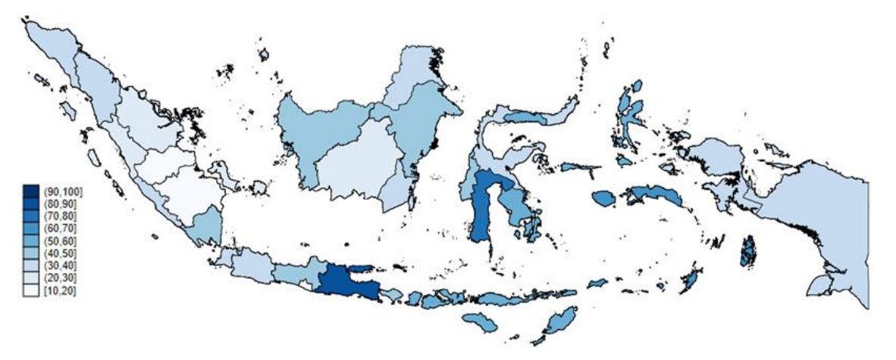

**Figure 1:** Indonesia Blue Economy Index (IBEI) by ARISE+ Indonesia in 2022.

Hierarchical Bayesian models can consider spatially and temporally structured latent random effects to account for spatial and temporal correlations. Although these models can be complex, Integrated Nested Laplace Approximation (INLA) offers an efficient alternative approach to Bayesian inference. INLA uses a deterministic numerical approach with Laplace approximation to estimate parameters and perform predictions with high accuracy [36, 40]. The main advantage of INLA is its ability to overcome the computational challenges faced by Markov Chain Monte Carlo (MCMC), especially in the context of big data. This method is particularly useful for Bayesian inference in hierarchical and mixed models [25, 41].

Although the advantages of INLA (Integrated Nested Laplace Approximation) have been widely recognized-particularly for its computational efficiency in approximating posterior distributions in complex hierarchical Bayesian models-its application in economics, especially through spatio-temporal Bayesian modeling, remains relatively limited. INLA has been increasingly adopted in fields such as epidemiology, ecology, and environmental sciences due to its flexibility in handling spatial and temporal random effects within latent Gaussian models. However, economic applications are still emerging. Maulina et al. [25] utilized INLA to model the poverty rate in Java Island using a Bayesian Spatial Probit approach with three types of spatial weighting matrices, namely Exponential Distance, Inverse Distance, and K-Nearest Neighbour (KNN), demonstrating how INLA can be adapted to binary economic outcomes with spatial correlation.

Meanwhile, Rachmawati and Pusponegoro [36] applied INLA to model poverty in East Java Province using a fully spatio-temporal Bayesian framework, highlighting INLA's strength in capturing both spatial heterogeneity and temporal dynamics in socioeconomic indicators. These studies suggest that the use of INLA in the economic domain to date has predominantly focused on poverty-related issues. In contrast, studies applying INLA to model more comprehensive economic indicators such as Gross Regional Domestic Product (GRDP), which reflect both spatial dependencies and temporal trends across regions, are still scarce. This highlights a significant research gap and an opportunity to advance the use of INLA in economic spatial-temporal modeling beyond poverty, paving the way for more nuanced and data-efficient regional economic analyses.

Furthermore, with regard to economic growth, this study will use data on gross regional domestic product (GRDP) at current prices as economic data for the response variable. Then, the factors that will be tested for their influence on it come from the variables used to compile the BEI. The large number of predictor variables used in regression analysis has the potential to cause multicollinearity problems caused by a high correlation between two or more variables. Dimensional reduction with Principal Component Analysis (PCA) is used in this study to overcome this problem [33, 42].

There are two objectives in this study:

1. Forming BEI for 154 regencies and cities on the Island of Sumatera based on 3 constituent pillars, namely environmental, economic, and social, involving 38 variables.
2. Identifying BEI constituent variables that have a significant effect on GRDP at current prices through spatio-temporal regression modeling for each province on the Island of Sumatera from 2019 to 2022 with the INLA approach.

From the regression model, we also identified spatial patterns that can reflect the relationship of blue economy potential to the characteristics and relationships between regions as well as temporal trends that reflect the sustainability of blue economy potential on the Island of Sumatera.

Then, we present related works related to the blue economy and GRDP in Section 2. The method of constructing the Blue Economy Index for the regency and city level in Sumatera Island as well as parametric, nonparametric, and nonparametric spatio-temporal regression modeling with INLA inference are presented in Section 3. The results and discussions will be explained in Section 4 and then, closed with conclusions, suggestions, and recommendations for further research in Section 5.

---

## 2 Related Works

### 2.1 Correlation between blue economy and GRDP also its influencing factors

Based on the Indonesia Blue Economy Roadmap [39], the Indonesia's Blue Economy Index (IBEI) with the support of ARISE+ Indonesia is used to monitor the progress of blue economy implementation in various regions in Indonesia. Based on the aspects of the SDGs to be achieved, IBEI is organized by three pillars, namely environment, economy, and social. The following is an explanation of each pillar of the blue economy. The correlation between blue economy and GRDP along with its influencing factors is presented in Table 1.

1. **Environmental Pillar:** Focuses on good environmental management to support the achievement of long-term sustainable economic growth. Good environmental management is seen through the quality of marine resources and conservation and the existence of renewable energy.
2. **Economic Pillar:** Focuses on the contribution of the marine sector to economic growth. This contribution is seen through capture fisheries and aquaculture, marine-based industries, tourism, and trade, transportation and logistics.
3. **Social Pillar:** Focuses on inclusiveness. This pillar measures how the marine sector can support the creation of community welfare. This includes health, education, also research and development.

**Table 1:** Results of previous research on GRDP.

| Author | Sample Place | Method | Findings |
|---|---|---|---|
| Ningsih (2017) [28] | Riau | Panel data regression | There is a significant influence of local own-source revenue, local expenditure, labor, and population density on GRDP. |
| Ervina and Jaya (2019) [14] | 33 provinces in Indonesia for the period 2010–2016 | Spatial lag fixed effect model | There is a positive and significant influence of population, local revenue, government expenditure, domestic investment, and foreign investment on GRDP. The number of workers does not have a significant influence. |
| Andayani (2018) [4] | Aceh Besar Regency | Location Quotient (LQ) and multiple regression models | There is an influence of the agriculture sector, the building sector, the trade sector, hotels and restaurants, the transportation and communication sector, the finance, rental and corporate services sector, and the services sector on GRDP. |
| Anastasya et al. (2023) [3] | Palopo city | Multiple spline regression | The number of accommodations does not have a significant influence on the growth rate of GRDP. Room occupancy rate and labor force participation rate have a significant influence on GRDP growth rate. |
| Nurmailis (2023) [29] | Bengkulu for the period 2018–2022 | Panel data regression Fixed Effect Model (FEM) | Human Development Index (HDI) and foreign investment have an influence on GRDP. |
| Nusrang et al. (2023) [30] | South Sulawesi in 2022 | Structural Equation Modelling-Partial Least Squares (SEM-PLS) | Public service expenditure and education have a significant effect on GRDP. |
| Wijayanti dan Laksono (2024) [45] | Lampung for the period 2017–2021 | Panel data regression Fixed Effect Model (FEM) | Population, regional own-source revenue, general allocation fund have an effect on GRDP. Regional expenditure has an effect on GRDP. |

### 2.2 Gross regional domestic product (GRDP) at current prices

GRDP is an economic indicator used to measure the ability of a region to create added value at a certain time. Based on the valuation version, GRDP and its derivative aggregates are presented in two forms, namely at current prices and at constant prices. GRDP at current prices is an economic value measured using prices in the current year, in contrast to GRDP at constant prices which is measured using prices of a certain base year [7].

---

## 3 Methods

### 3.1 Development of Blue Economy Index (BEI) for Sumatera Island

This research introduces a new concept in measuring the potential of the blue economy through the development of the Blue Economy Index (BEI). Based on the pillars forming the IBEI, the measurement of blue economy potential can be seen through three dimensions, namely environmental, economic, and social. However, some of the variables used in this study contain missing values. Therefore, before performing the calculation, it is necessary to impute missing values using the Classification and Regression Trees (CART) method [11].

After obtaining complete data, the preparation of the blue economy index was carried out by adopting the calculation concept issued by the United Nations Development Program (UNDP) in compiling the Human Development Index (HDI) [17]. The steps for preparing the index include:

1. Data standardization with min-max normalization.
2. Calculating the index of constituent dimensions (I) with the arithmetic average method.
3. Aggregating dimensional indices to generate BEI by geometric mean method:

$$\text{BEI} = \sqrt[3]{I_{\text{environment}} \times I_{\text{economy}} \times I_{\text{social}}} \times 100. \tag{1}$$

### 3.2 Principal component analysis

Principal Component Analysis (PCA) is a statistical method used to reduce the dimensionality of data while retaining as much information as possible [16, 18]. This technique works by identifying and extracting the principal components that explain the maximum variation in the dataset. By projecting the data into a lower dimensional space, PCA not only reduces the complexity of the data but also helps eliminate redundancy and noise, thus avoiding multicollinearity problems and increasing the interpretability and efficiency of the analysis. The process involves calculating the eigenvalues and eigenvectors of the covariance matrix of the data, where the principal components are sorted based on their contribution to the total variability [15]. The new data resulting from dimensionality reduction by PCA is done by multiplying the original data matrix (D) with the matrix containing the eigenvectors (V) or mathematically can be explained by the following formula [8, 42]:

$$PC = D \times V. \tag{2}$$

### 3.3 Bayesian spatio-temporal regression

The main focus in Bayesian inference with the INLA approach is to determine the posterior distribution using prior distribution to estimate the parameters and hyperparameters [48]. In this study, the response variable used has a lognormal distribution where $\mu$ and $\sigma^2$ respectively describe the expected value or mean and variance of the response variable $y$ in logarithmic form.

$$y \sim \text{Lognormal}(\mu, \sigma^2). \tag{3}$$

When the response variable is lognormal distributed, the spatial model used is Besag-York-Mollie 2 (BYM2), and the temporal model is Random Walk order 2 (RW2), the parametric, nonparametric, and nonparametric spatio-temporal regressions with interactions are as follows:

$$\log(\hat{Y}) = a + \sum_{m=1}^{M} b_m PC_{mi} + \frac{1}{\sqrt{\tau_b}}\left(\sqrt{1-\phi}\,v_i + \sqrt{\phi}\,u_i\right) + (\beta + \delta_i) \times t_j, \tag{4}$$

$$\log(\hat{Y}) = a + \sum_{m=1}^{M} b_m PC_{mi} + \frac{1}{\sqrt{\tau_b}}\left(\sqrt{1-\phi}\,v_i + \sqrt{\phi}\,u_i\right) + \gamma_t + \phi_t, \tag{5}$$

$$\log(\hat{Y}) = a + \sum_{m=1}^{M} b_m PC_{mi} + \frac{1}{\sqrt{\tau_b}}\left(\sqrt{1-\phi}\,v_i + \sqrt{\phi}\,u_i\right) + \gamma_t + \phi_t + \delta_{it}. \tag{6}$$

In (4)-(6), $\log(\hat{Y})$ represents the response variable in logarithmic scale, while $a$ is a constant that describes the condition when all regression predictor variables, both fixed effects and random effects, are zero. The coefficient $b_m$ is associated with the predictor variable $PC_{mi}$, which is a fixed effect resulting from dimension reduction using Principal Component Analysis (PCA). The spatial random effects component $\frac{1}{\sqrt{\tau_b}}(\sqrt{1-\phi}\,v_i + \sqrt{\phi}\,u_i)$ was modeled using the BYM2 approach with $u_i$ and $v_i$ representing structured and unstructured spatial random effects, respectively [12, 6]. The parameters $\phi$ and $1-\phi$ indicate the proportion of variance associated with the two spatial random effects, while $\tau_b$ represents the total contribution of the spatial random effects in the model. The temporal random effects component is described by $\beta$ as a fixed effect that represents the global temporal trend in the parametric model (4). Meanwhile, $\gamma_t$ and $\phi_t$ describe the structured and unstructured temporal random effects in the nonparametric model and the nonparametric model with interaction, (5) and (6). In addition, in the parametric model with interaction, the parameter $\delta_i$ is used to describe the difference between the global temporal trend $\beta$ and the specific temporal trend in each region $i$ at time $t_j$. Meanwhile, in the nonparametric model with interaction (6), the parameter $\delta_{it}$ reflects the random effect of spatio-temporal interaction.

Based on the type of interaction, the interaction between spatial and temporal random effects can be divided into four. The four types of interactions are given in Table 2 as follows [10]:

**Table 2:** Spatio-temporal interaction type.

| Interaction Type | Interacting Parameters | Spatial | Temporal | Rank |
|---|---|---|---|---|
| 1 | $v_i$ and $\phi_t$ | Unstructured | Unstructured | $nT$ |
| 2 | $v_i$ and $\gamma_t$ | Unstructured | Structured | $n(T-2)$ for RW2 |
| 3 | $u_i$ and $\phi_t$ | Structured | Unstructured | $(n-1)T$ |
| 4 | $u_i$ and $\gamma_t$ | Structured | Structured | $(n-1)(T-2)$ for RW2 |

In Table 2, $n$ represents the number of regions in spatial analysis, while $T$ indicates the number of time periods in temporal analysis. Furthermore, based on the explanation of (5) and (6), there are temporal random effect components, namely $\gamma_t$ as a structured random effect and $\phi_t$ as an unstructured random effect. The structured temporal random effect component $\gamma_t$ is modeled using the RW2 (Second Order Random Walk) approach, which can be mathematically expressed in (7). Meanwhile, the unstructured temporal random effect $\phi_t$ is assumed to follow the Normal distribution with mean 0 and variance $1/\tau_\phi$,

$$\gamma_t \mid \gamma_{t-1}, \gamma_{t-2} \sim \text{Normal}(2\gamma_{t-1} + \gamma_{t-2}, \sigma^2). \tag{7}$$

### 3.4 INLA inference

Integrated Nested Laplace Approximation (INLA) is an efficient Bayesian method for analyzing complex statistical models, especially those involving spatial or temporal dependencies. INLA works by defining a model that includes likelihood functions, prior distributions for parameters, and latent field structures, then using Laplace approximation to estimate the posterior distributions of latent fields and model parameters. Laplace approximation is applied in a multi-stage manner, first estimating the posterior of the latent field conditionally on the hyperparameters, then estimating the posterior of the hyperparameters. INLA further uses numerical integration to integrate the latent fields from the posterior distribution, resulting in marginal posterior distributions for the model parameters. As a result, INLA enables estimation of parameters and their uncertainties, as well as predictions for new observations by considering spatial or temporal dependencies. The advantages of INLA lie in its computational efficiency, approximation accuracy, and flexibility in handling various models [41].

To estimate the model parameters contained in (4)-(6), a Bayesian inference approach with the INLA method is used. In Bayesian inference, all unknown parameters are considered as random variables, which often poses a challenge when the number of correlated parameters is quite large. This complexity can be solved by applying the concept of Bayes' theorem, as stated in (8),

$$\pi(\theta \mid y) = \frac{\pi(y \mid \theta)\pi(\theta)}{\pi(y)}, \tag{8}$$

where $\pi(\theta \mid y)$ is defined as posterior distribution, $\pi(y \mid \theta)$ and $\pi(\theta)$ as likelihood and prior distribution respectively, also $\pi(y)$ is evidence or normalization factor [10, 35].

Through the INLA approach, the joint posterior distribution is then used to determine the marginal posterior distribution of each parameter by utilizing the Taylor series expansion method [10]. This approach serves to numerically approximate Laplace in order to obtain accurate results while being computationally efficient. Mathematically, this concept can be expressed in (9),

$$\tilde{\pi}(\psi_k \mid y) \approx \sum_j \tilde{\pi}(\psi_k \mid \theta^{(j)}, y)\,\tilde{\pi}(\theta^{(j)} \mid y)\,\Delta_j. \tag{9}$$

### 3.5 Research framework

The research framework used as a guide in conducting research in order to achieve research objectives based on previous research studies is as following Figure 2:

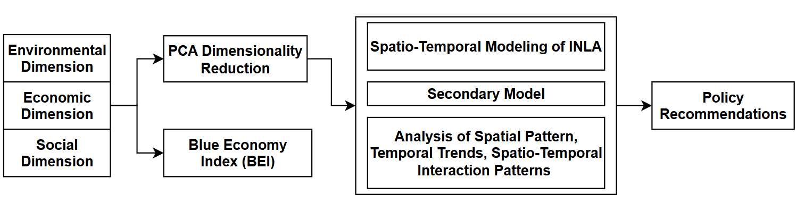

**Figure 2:** Research framework.

### 3.6 Research variables and data

Based on data availability, this study was conducted for a 4-year period from 2019 to 2022. The sample selected was 154 regencies/cities on the Island of Sumatera where the total observations were 616 data. This study uses data from Statistics of the Ministry of Maritime Affairs and Fisheries (Statistik KKP) (https://statistik.kkp.go.id/), Central Agency of Statistics (BPS) (https://www.bps.go.id/), National Waste Management Information System (SIPSN) (https://sipsn.menlhk.go.id/), and Satu Data Parekraf (https://satudata.kemenparekraf.go.id/). To describe all aspects used in compiling the blue economy index at the regency and city level, this study used 38 variables as shown in Figure 3 and Table 3.

**Table 3:** Research variables and data.

| Variable code | Variable |
|---|---|
| **Environmental dimension** | |
| $X_{laquiet}$ | Land area for quiet water ponds enlargement cultivation (m²) |
| $X_{lafresh}$ | Land area of freshwater hatchery cultivation (m²) |
| $X_{wastegen}$ | Annual waste generation (ton) |
| $X_{wastemanage}$ | Annual waste management amount (ton) |
| $X_{wasterecycle}$ | Annual waste recycling amount (ton) |
| $X_{pln}$ | Percentage distribution of households with PLN electric lighting sources (%) |
| $X_{nonpln}$ | Percentage distribution of households with non-PLN electric lighting sources (%) |
| $X_{nonelectric}$ | Percentage distribution of households with non-electric lighting sources (%) |
| **Economic dimension** | |
| $X_{seavessel}$ | Number of sea business vessels (unit) |
| $X_{inlandvessel}$ | Number of inland public waters business vessels (unit) |
| $X_{fishprounit}$ | Micro and small fish processing units (unit) |
| $X_{hquiet}$ | Quiet water ponds enlargement aquaculture households (unit) |
| $X_{hsea}$ | Sea capture fishery households (unit) |
| $X_{hinland}$ | Inland public waters capture fishery households (unit) |
| $X_{hfresh}$ | Freshwater hatchery aquaculture households (unit) |
| $X_{volfresh}$ | Freshwater hatchery aquaculture fish production volume (thousand tails) |
| $X_{volquiet}$ | Quiet water ponds enlargement aquaculture fish production volume (kg) |
| $X_{volinland}$ | Inland public waters capture fishery fish production volume (kg) |
| $X_{valuefresh}$ | Freshwater hatchery aquaculture fish production value (million) |
| $X_{valuequiet}$ | Quiet water ponds enlargement aquaculture fish production value (thousand rupiah) |
| $X_{valueinland}$ | Inland public waters capture fishery fish production value (thousand rupiah) |
| $X_{touristorigin}$ | Number of national tourist trips by regency/city of origin (trip) |
| $X_{touristdestination}$ | Number of national tourist trips by regency/city of destination (trip) |
| **Social dimension** | |
| $X_{menquiet}$ | Number of quiet water ponds enlargement aquaculture fishermen (person) |
| $X_{mensea}$ | Number of sea capture fishery fishermen (person) |
| $X_{meninland}$ | Number of inland public waters capture fishery fishermen (person) |
| $X_{menfresh}$ | Number of freshwater hatchery aquaculture fishermen (person) |
| $X_{unemploy}$ | Open unemployment rate (%) |
| $X_{laborforce}$ | Labor force participation rate (%) |
| $X_{poor}$ | Percentage of poor population (%) |
| $X_{pbibpjs}$ | Percentage of population with PBI BPJS health insurance (%) |
| $X_{nonpbibpjs}$ | Percentage of population with non PBI BPJS health insurance (%) |
| $X_{jamkesmas}$ | Percentage of population with Jamkesmas health insurance (%) |
| $X_{private}$ | Percentage of population with private health insurance (%) |
| $X_{company}$ | Percentage of population with company health insurance (%) |
| $X_{water}$ | Percentage of Population with Access to Adequate Drinking water sources (%) |
| $X_{highsch}$ | Number of high school students under the Ministry of Education and Culture (person) |
| $X_{vocsch}$ | Number of vocational school students under the Ministry of Education and Culture (person) |

---

## 4 Results and Discussion

### 4.1 Descriptive analysis

Based on Table 4, it can be concluded that the social pillar compared to the other two pillars is the most dominant contributor to the index calculation, which is more than 20 percent for the average of all regencies and cities on the Island of Sumatera each year from 2019 to 2022. Meanwhile, the environmental and economic pillars contributed less than 20 percent. This shows that most of the population of Sumatera Island relies on fisheries and marine resources for their livelihoods. However, efforts to develop a blue economy on the Island of Sumatera are still not optimal in terms of resource management and increasing added value.

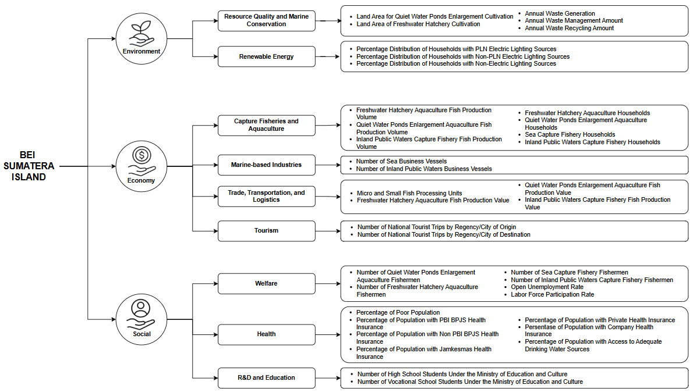

**Figure 3:** Sumatera Island BEI compilation pillars by regency and city (2019–2022).

**Table 4:** Overview of the dimensions of BEI in Sumatera from 2019 to 2022.

| Pillar | 2019 Mean | 2019 SD | 2019 Min | 2019 Max | 2020 Mean | 2020 SD | 2020 Min | 2020 Max |
|---|---|---|---|---|---|---|---|---|
| Environment | 0.195 | 0.076 | 0.060 | 0.530 | 0.178 | 0.074 | 0.130 | 0.523 |
| Economy | 0.072 | 0.064 | 0.009 | 0.337 | 0.081 | 0.066 | 0.010 | 0.411 |
| Social | 0.219 | 0.055 | 0.115 | 0.441 | 0.232 | 0.052 | 0.129 | 0.456 |

| Pillar | 2021 Mean | 2021 SD | 2021 Min | 2021 Max | 2022 Mean | 2022 SD | 2022 Min | 2022 Max |
|---|---|---|---|---|---|---|---|---|
| Environment | 0.071 | 0.073 | 0.010 | 0.381 | 0.176 | 0.056 | 0.128 | 0.424 |
| Economy | 0.071 | 0.060 | 0.012 | 0.309 | 0.079 | 0.060 | 0.008 | 0.369 |
| Social | 0.226 | 0.053 | 0.129 | 0.518 | 0.234 | 0.052 | 0.127 | 0.438 |

Based on the results of the index calculation, the average BEI value of Sumatera Island each year has not yet reached 20 percent. For 4 years, the average BEI value of Sumatera Island reached less than 10 only in 2021. Meanwhile, the average BEI for the other three years reached 13.51 in 2019, 14.17 in 2020, and 14.11 in 2022. Meanwhile, in 2021, the average only reached 9.21 for the Sumatera Island level. For more details, the distribution of BEI values in Sumatera Island for 4 years can be seen in Figure 4.

**Figure 4:** BEI by regency and city in Sumatera Island (2019-2022). *(four panels)*

| | |
|---|---|
| 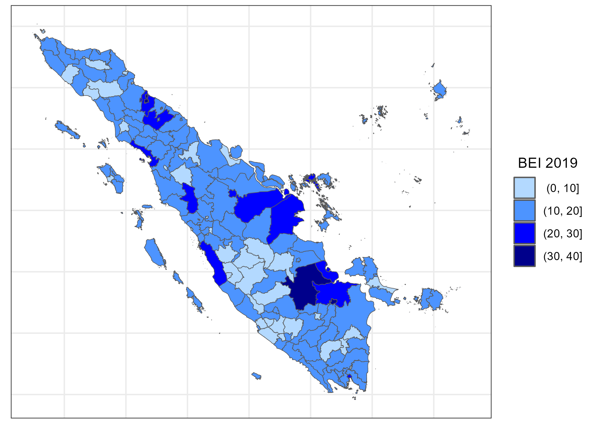 | 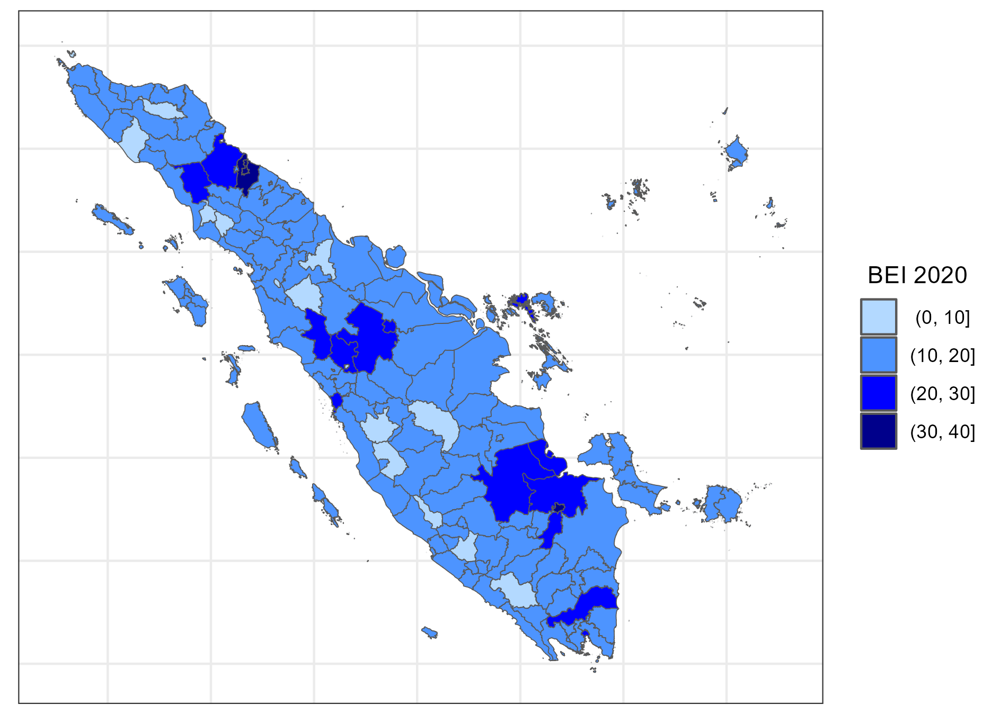 |
| 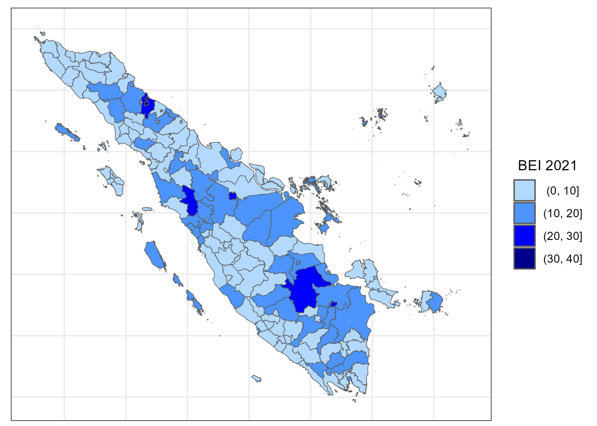 | 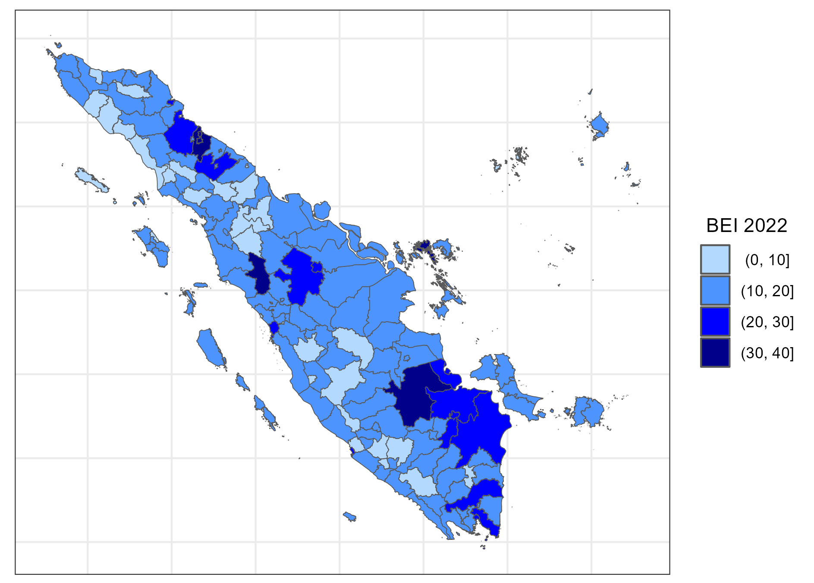 |

From 2019 to 2022, the five regions in Sumatera Island with the highest BEI values are consistently Medan City, Palembang City, Musi Banyuasin, Deli Serdang, and Pasaman. The five regions with BEI values ranging between 25 and 40 for four consecutive years are spread across North Sumatera, South Sumatera, and West Sumatera. However, in 2022, Batam City shifted Palembang City's position in the top five list.

Over a period of four years, the five regions on the Island of Sumatera with the lowest BEI values have always been different. In 2019, the five regions included Sabang City, Solok City, Payakumbuh City, Padang Panjang City, and Sungai Penuh City. In 2020, the five regions changed to Tebo, Empat Lawang, Pakpak Bharat, South Ogan Komering Ulu, and Subulussalam City. In 2021 and 2022, two regions, Tebo and Subulussalam City, are still among the five regions with the lowest BEI values. However, the other three regions are different. In 2021, the three regions include Sabang City, West Aceh, and Sawahlunto City. Meanwhile, in 2022, the three regions are Solok City, Humbang Hasundutan, and Lebong. During these four years, the regions that are not included in the lowest five categories are located in the provinces of Bangka Belitung Islands, Riau Islands, Lampung, and Riau.

### 4.2 PCA dimensionality reduction analysis

After forming an index to measure the potential of the blue economy on the Island of Sumatera, spatio-temporal regression modeling was conducted to determine the factors of the blue economy that affect economic growth on the Island of Sumatera. Economic growth is seen through the GRDP at current prices value of each regency and city on the Island of Sumatera. Dimensional reduction with PCA is done before spatio-temporal regression modeling with the aim of preventing multicollinearity in regression modeling involving many predictor variables.

This study conducted spatio-temporal modeling for each province. The aim is to understand the distribution pattern of GRDP at current prices in each province based on the variables used to construct the BEI. Therefore, dimension reduction with PCA was conducted for each province showing the following results.

This research conducts spatio-temporal modeling in analyzing the distribution pattern of GRDP at current prices in each province. To understand the factors that affect GRDP at current prices, this study uses variables that have been used in the preparation of BEI. Before modeling, dimensional reduction with PCA was carried out which resulted in principal components (PC) for each province and the following results were obtained:

**Table 5:** Number of PCs and cumulative proportion.

| Province | Number of PCs | Cumulative Proportion |
|---|---|---|
| Aceh | 11 | 78.3 |
| Bengkulu | 9 | 78.2 |
| Jambi | 7 | 79.2 |
| Bangka Belitung Island | 8 | 77.6 |
| Riau Island | 7 | 79.02 |
| Lampung | 8 | 79.03 |
| Riau | 7 | 77.42 |
| West Sumatera | 8 | 76.8 |
| South Sumatera | 8 | 79.38 |
| North Sumatera | 10 | 77.6 |

Number of PCs describes the number of principal components resulting from dimension reduction with PCA which will then be used as predictor variables in Bayesian spatio-temporal regression modeling with INLA for each province. While cumulative proportion explains the percentage of total variance in the data that can be explained by a number of principal components that have been selected for each province. The results of dimension reduction in Table 5 show that each province produces a different number of main components that can explain 80 percent of the overall data variation based on Kaiser Criterion and screeplot. Furthermore, the predictor variables for each main component were grouped based on the loading factor value of each variable. The results of variable grouping can be seen in Table 6.

**Table 6:** Variable grouping in PC.

| Province | PC | Variable |
|---|---|---|
| Aceh | 1 | $X_{unemploy}$, $X_{touristorigin}$, $X_{touristdestination}$, $X_{poor}$, $X_{private}$, $X_{vocsch}$ |
| | 2 | $X_{mensea}$, $X_{seavessel}$, $X_{hquiet}$, $X_{hsea}$, $X_{valuequiet}$ |
| | 3 | $X_{jamkesmas}$, $X_{nonelectric}$ |
| | 4 | $X_{hfresh}$ |
| | 5 | $X_{meninland}$, $X_{inlandvessel}$, $X_{hinland}$, $X_{nonpbibpjs}$ |
| | 6 | $X_{volinland}$, $X_{valueinland}$ |
| | 7 | $X_{wastegen}$, $X_{wastemanage}$, $X_{wasterecycle}$ |
| | 8 | $X_{menquiet}$, $X_{fishprounit}$, $X_{laborforce}$, $X_{pln}$, $X_{nonpln}$, $X_{highsch}$ |
| | 9 | $X_{lafresh}$, $X_{menfresh}$, $X_{volfresh}$, $X_{valuefresh}$, $X_{pbibpjs}$ |
| | 10 | $X_{volquiet}$, $X_{company}$ |
| | 11 | $X_{laquiet}$, $X_{water}$ |
| Bengkulu | 1 | $X_{fishprounit}$, $X_{unemploy}$, $X_{laborforce}$, $X_{touristorigin}$, $X_{touristdestination}$, $X_{nonpbibpjs}$, $X_{private}$, $X_{company}$, $X_{highsch}$, $X_{vocsch}$ |
| | 2 | $X_{volfresh}$, $X_{volquiet}$, $X_{valuefresh}$, $X_{valuequiet}$ |
| | 3 | $X_{meninland}$, $X_{inlandvessel}$, $X_{laquiet}$, $X_{hinland}$, $X_{hfresh}$ |
| | 4 | $X_{menfresh}$, $X_{wastegen}$, $X_{wastemanage}$, $X_{wasterecycle}$ |
| | 5 | $X_{mensea}$, $X_{seavessel}$, $X_{hsea}$, $X_{lafresh}$, $X_{nonelectric}$ |
| | 6 | $X_{volinland}$, $X_{poor}$, $X_{water}$ |
| | 7 | $X_{valueinland}$, $X_{pbibpjs}$, $X_{jamkesmas}$ |
| | 8 | $X_{pln}$ |
| | 9 | $X_{menquiet}$, $X_{hquiet}$, $X_{nonpln}$ |
| Jambi | 1 | $X_{hfresh}$, $X_{menfresh}$, $X_{volfresh}$, $X_{unemploy}$, $X_{valuefresh}$, $X_{touristdestination}$, $X_{nonpbibpjs}$, $X_{company}$, $X_{highsch}$, $X_{vocsch}$ |
| | 2 | $X_{menquiet}$, $X_{fishprounit}$, $X_{laquiet}$ |
| | 3 | $X_{poor}$, $X_{pbibpjs}$, $X_{pln}$, $X_{nonpln}$, $X_{nonelectric}$ |
| | 4 | $X_{mensea}$, $X_{seavessel}$, $X_{laquiet}$, $X_{hsea}$, $X_{volquiet}$, $X_{valuequiet}$ |
| | 5 | $X_{lafresh}$, $X_{wasterecycle}$, $X_{jamkesmas}$, $X_{private}$ |
| | 6 | $X_{meninland}$, $X_{inlandvessel}$, $X_{hinland}$, $X_{volinland}$, $X_{valueinland}$ |
| | 7 | $X_{laborforce}$, $X_{wastegen}$, $X_{wastemanage}$, $X_{touristorigin}$, $X_{water}$ |
| Bangka Belitung Island | 1 | $X_{mensea}$, $X_{unemploy}$, $X_{nonelectric}$ |
| | 2 | $X_{hfresh}$, $X_{menfresh}$, $X_{volfresh}$, $X_{volquiet}$, $X_{valuequiet}$, $X_{pbibpjs}$, $X_{highsch}$, $X_{vocsch}$ |
| | 3 | $X_{meninland}$, $X_{inlandvessel}$, $X_{hinland}$, $X_{wastegen}$, $X_{touristorigin}$, $X_{touristdestination}$, $X_{nonpbibpjs}$ |
| | 4 | $X_{menquiet}$, $X_{fishprounit}$, $X_{hquiet}$ |
| | 5 | $X_{laquiet}$, $X_{lafresh}$, $X_{laborforce}$, $X_{poor}$, $X_{jamkesmas}$ |
| | 6 | $X_{volinland}$, $X_{wasterecycle}$, $X_{valuefresh}$, $X_{valueinland}$, $X_{private}$, $X_{water}$ |
| | 7 | $X_{pln}$, $X_{nonpln}$ |
| | 8 | $X_{seavessel}$, $X_{hsea}$, $X_{wastemanage}$, $X_{company}$ |
| Riau Island | 1 | $X_{volquiet}$, $X_{unemploy}$, $X_{wastegen}$, $X_{wastemanage}$, $X_{valuequiet}$, $X_{pbibpjs}$, $X_{highsch}$, $X_{vocsch}$ |
| | 2 | $X_{meninland}$, $X_{inlandvessel}$, $X_{hinland}$, $X_{lafresh}$, $X_{poor}$, $X_{nonelectric}$ |
| | 3 | $X_{mensea}$, $X_{seavessel}$, $X_{hsea}$, $X_{jamkesmas}$ |
| | 4 | $X_{volfresh}$, $X_{valuefresh}$, $X_{private}$, $X_{water}$, $X_{pln}$, $X_{nonpln}$ |
| | 5 | $X_{menquiet}$, $X_{fishprounit}$, $X_{hfresh}$, $X_{menfresh}$ |
| | 6 | $X_{volinland}$, $X_{valueinland}$, $X_{touristorigin}$, $X_{touristdestination}$, $X_{nonpbibpjs}$, $X_{company}$ |
| | 7 | $X_{laquiet}$, $X_{hquiet}$, $X_{laborforce}$, $X_{wasterecycle}$ |
| Lampung | 1 | $X_{lafresh}$, $X_{unemploy}$, $X_{laborforce}$, $X_{touristorigin}$, $X_{touristdestination}$, $X_{company}$, $X_{nonpln}$, $X_{vocsch}$ |
| | 2 | $X_{menquiet}$, $X_{hquiet}$, $X_{volquiet}$, $X_{valuequiet}$, $X_{highsch}$ |
| | 3 | $X_{mensea}$, $X_{meninland}$, $X_{seavessel}$, $X_{fishprounit}$, $X_{hsea}$, $X_{pln}$ |
| | 4 | $X_{laquiet}$, $X_{wastegen}$, $X_{wastemanage}$, $X_{wasterecycle}$ |
| | 5 | $X_{volinland}$, $X_{valueinland}$ |
| | 6 | $X_{volfresh}$, $X_{valuefresh}$, $X_{poor}$, $X_{pbibpjs}$ |
| | 7 | $X_{hfresh}$, $X_{menfresh}$, $X_{nonpbibpjs}$, $X_{jamkesmas}$, $X_{private}$ |
| | 8 | $X_{inlandvessel}$, $X_{hinland}$, $X_{water}$, $X_{nonelectric}$ |
| Riau | 1 | $X_{hquiet}$, $X_{wastegen}$, $X_{wastemanage}$, $X_{nonpbibpjs}$, $X_{private}$, $X_{vocsch}$ |
| | 2 | $X_{menquiet}$, $X_{inlandvessel}$, $X_{hinland}$, $X_{hfresh}$, $X_{volquiet}$, $X_{wasterecycle}$, $X_{valuequiet}$ |
| | 3 | $X_{seavessel}$, $X_{hsea}$, $X_{menfresh}$, $X_{laborforce}$, $X_{valueinland}$, $X_{water}$ |
| | 4 | $X_{mensea}$, $X_{lafresh}$, $X_{volinland}$, $X_{touristorigin}$, $X_{touristdestination}$, $X_{highsch}$ |
| | 5 | $X_{laquiet}$, $X_{jamkesmas}$, $X_{pln}$, $X_{nonpln}$, $X_{nonlistik}$ |
| | 6 | $X_{meninland}$, $X_{fishprounit}$, $X_{unemploy}$, $X_{pbibpjs}$ |
| | 7 | $X_{volfresh}$, $X_{valuefresh}$, $X_{poor}$, $X_{company}$ |
| West Sumatera | 1 | $X_{unemploy}$, $X_{laborforce}$, $X_{nonpbibpjs}$, $X_{company}$, $X_{water}$, $X_{vocsch}$ |
| | 2 | $X_{menquiet}$, $X_{laquiet}$, $X_{hquiet}$, $X_{hfresh}$, $X_{lafresh}$, $X_{volquiet}$, $X_{valuequiet}$ |
| | 3 | $X_{mensea}$, $X_{seavessel}$, $X_{hsea}$, $X_{poor}$, $X_{pln}$, $X_{nonelectric}$, $X_{highsch}$ |
| | 4 | $X_{wastegen}$, $X_{jamkesmas}$ |
| | 5 | $X_{meninland}$, $X_{inlandvessel}$, $X_{fishprounit}$, $X_{hinland}$, $X_{private}$, $X_{nonpln}$ |
| | 6 | $X_{volinland}$, $X_{valueinland}$ |
| | 7 | $X_{menfresh}$, $X_{volfresh}$, $X_{valuefresh}$ |
| | 8 | $X_{wastemanage}$, $X_{wasterecycle}$, $X_{touristorigin}$, $X_{touristdestination}$, $X_{pbibpjs}$ |
| South Sumatera | 1 | $X_{fishprounit}$, $X_{wastegen}$, $X_{wastemanage}$, $X_{wasterecycle}$, $X_{touristorigin}$, $X_{touristdestination}$, $X_{private}$, $X_{highsch}$, $X_{vocsch}$ |
| | 2 | $X_{menquiet}$, $X_{meninland}$, $X_{inlandvessel}$, $X_{laquiet}$, $X_{hquiet}$, $X_{hinland}$, $X_{volinland}$, $X_{valueinland}$, $X_{pln}$, $X_{nonpln}$ |
| | 3 | $X_{mensea}$, $X_{seavessel}$, $X_{volquiet}$ |
| | 4 | $X_{menfresh}$, $X_{volfresh}$, $X_{valuefresh}$ |
| | 5 | $X_{hsea}$ |
| | 6 | $X_{hfresh}$, $X_{lafresh}$, $X_{valuequiet}$, $X_{jamkesmas}$ |
| | 7 | $X_{nonpbibpjs}$, $X_{company}$, $X_{water}$ |
| | 8 | $X_{unemploy}$, $X_{laborforce}$, $X_{poor}$, $X_{pbibpjs}$, $X_{nonelectric}$ |
| North Sumatera | 1 | $X_{touristorigin}$, $X_{company}$, $X_{highsch}$, $X_{vocsch}$ |
| | 2 | $X_{seavessel}$, $X_{hsea}$, $X_{poor}$, $X_{nonpbibpjs}$, $X_{nonelectric}$ |
| | 3 | $X_{fishprounit}$, $X_{laquiet}$, $X_{hquiet}$, $X_{volquiet}$, $X_{valuequiet}$ |
| | 4 | $X_{mensea}$, $X_{meninland}$, $X_{inlandvessel}$, $X_{hinland}$, $X_{private}$ |
| | 5 | $X_{water}$, $X_{pln}$, $X_{nonpln}$ |
| | 6 | $X_{hfresh}$, $X_{lafresh}$, $X_{menfresh}$ |
| | 7 | $X_{volfresh}$, $X_{valuefresh}$ |
| | 8 | $X_{unemploy}$, $X_{laborforce}$, $X_{wastegen}$, $X_{wastemanage}$, $X_{jamkesmas}$ |
| | 9 | $X_{volinland}$, $X_{wasterecycle}$, $X_{valueinland}$, $X_{touristdestination}$ |
| | 10 | $X_{menquiet}$, $X_{pbibpjs}$ |

### 4.3 Spatio-temporal modeling analysis of INLA

#### 4.3.1 Secondary model identification

After obtaining new predictor variables that are less and mutually independent based on the results of dimension reduction with PCA, spatio-temporal regression modeling with the INLA approach will be carried out for each province. There are 6 models for each province that have been tested in this study to determine the influence of various factors in terms of blue economy on GRDP at current prices by regency and city. The modeling formed is a parametric, nonparametric, and nonparametric model with interaction using spatial random effects with the Besag-York-Mollie 2 (BYM2) model and temporal random effects with the Random Walk order 2 (RW2) model. Each province is analyzed using these three approaches to understand the characteristics of the GRDP phenomenon in Sumatera Island. The characteristics of GRDP between provinces may vary, so the temporal trend in a province may be better suited to a parametric structure, while in another province, it is better suited to a nonparametric approach. Therefore, this study aims to determine the best model that is most suitable in describing the spatial and temporal patterns of GRDP in each province. The modeling results can be seen in Table 7.

**Table 7:** Summary of DIC and WAIC values for each province in Sumatera Island. *(Bolded values mark the secondary model selected for that province.)*

| Province | Reliability value | Parametric | Nonparametric, without interaction | Nonparametric, Type 1 | Nonparametric, Type 2 | Nonparametric, Type 3 | Nonparametric, Type 4 |
|---|---|---|---|---|---|---|---|
| Aceh | DIC | −866.34 | −780.98 | −1041.1 | −945.82 | −947.94 | **−947.69** |
| | WAIC | −868.97 | −781.73 | −1057.6 | −958.8 | −953.55 | **−950.41** |
| Bengkulu | DIC | −340.33 | −326.44 | −443.94 | −425.06 | −330.97 | **−413.6** |
| | WAIC | −343.32 | −325.8 | −450.41 | −433.26 | −333.36 | **−419.12** |
| Jambi | DIC | −275.52 | −247.2 | −393.92 | **−330.18** | −389.42 | −298.97 |
| | WAIC | −275.86 | −244.52 | −402.32 | **−331.58** | −400.86 | −294.89 |
| Bangka Belitung Island | DIC | −212.29 | −262.64 | −284.94 | **−281.81** | −270.69 | −276.38 |
| | WAIC | −212.72 | −264.63 | −282.99 | **−288.12** | −274.8 | −280.57 |
| Riau Island | DIC | −141.65 | −162.25 | −163.88 | **−156.72** | −140.88 | −242.54 |
| | WAIC | −140.68 | −162.25 | −163.79 | **−157.71** | −140.8 | −252.13 |
| Lampung | DIC | **−447.71** | −579.89 | −611.85 | −625.61 | −603.01 | −632.2 |
| | WAIC | **−446.64** | −577.92 | −609.76 | −641.33 | −604.75 | −642.14 |
| Riau | DIC | −161.4 | −183.78 | **−325.5** | −260.56 | −314.63 | −316.93 |
| | WAIC | −159.16 | −184.66 | **−334.82** | −273.7 | −323.79 | −326.93 |
| West Sumatera | DIC | **−603.1** | −688.24 | −775.49 | −828.95 | −674.97 | −660.5 |
| | WAIC | **−599.46** | −678.01 | −773.76 | −851.11 | −668.65 | −663.2 |
| South Sumatera | DIC | −414.23 | −377.18 | −626.38 | −592.57 | −384.26 | **−621.39** |
| | WAIC | −413.04 | −372.11 | −639.63 | −613.66 | −384.9 | **−637.17** |
| North Sumatera | DIC | −1177.58 | −1194.03 | −1299.9 | **−1484.3** | −1315.2 | −1357.9 |
| | WAIC | −1178.63 | −1193.05 | −1322.1 | **−1513.8** | −1325.7 | −1366.7 |

Deviance Information Criterion (DIC) and Watanabe-Akaike Information Criterion (WAIC) are two model performance evaluation metrics used to select the best model in Bayesian analysis. They are used to compare different models based on the balance between model fit and model complexity (regularization). The smaller the DIC and WAIC values indicate the better the model is at explaining the phenomenon under study [48]. Based on the DIC and WAIC values obtained, it is known that the best model for most provinces in Sumatera Island does not show any factors that have a significant effect on GRDP at current prices (in units of hundreds of billions of rupiah). This conclusion is based on the analysis of 95% credibility intervals for each variable in the six models tested in each province. A 95% credibility interval that includes a value of zero indicates that the factor has no significant impact on GRDP in the region. In addition, this result reflects that the blue economy potential in each province in Sumatera has not been optimally utilized, which could be one of the reasons why the factors tested have not shown a significant influence on economic growth in the region. Therefore, in this study, a secondary model will be selected to be used for further analysis. The secondary model is defined as a model that is not the best model but has a significant influential factor while still paying attention to the DIC and WAIC values obtained.

Through the secondary model, a better and more comprehensive understanding of the factors affecting GRDP at current prices can be obtained so as to improve the accuracy of model predictions and strengthen the basis for interpreting research results. Thus, formulating more effective policies can be an appropriate intervention strategy in increasing economic growth through GRDP at current prices. Of the six models that have been tested for each province, only four models can be selected as secondary models. The four models include parametric models and nonparametric models with Type 1, 2, and 4 interactions.

The analysis shows that the secondary model for GRDP at current prices varies across provinces (indicated by the bolded DIC and WAIC values). Lampung and West Sumatera use parametric models, while the other eight provinces use nonparametric models as secondary models. Riau is the only province that uses a Type 1 nonparametric model as a secondary model, which indicates that unstructured spatial and temporal random effects interact with each other. Jambi, Bangka Belitung Islands, Riau Islands, and North Sumatera used a nonparametric model with Type 2 interaction, where unstructured spatial and structured temporal random effects interact with each other. The other three provinces, namely Aceh, Bengkulu, and South Sumatera use a nonparametric model with the ability to identify the interaction between spatial random effects and structured temporal (interaction Type 4).

#### 4.3.2 Parameter estimation results on secondary model

**Parametric model**

Based on the 95 percent credibility interval values shown in Tables 8–11, it can be seen that some of the blue economy index constituent indicators from the environmental, economic, and social dimensions have a significant influence on GRDP at current prices for ten provinces on the Island of Sumatera. The significance of the influence of the predictor variables that make up the BEI on the response variable of GRDP at current prices can be seen through the value of the 95 percent credibility interval that does not include the value of zero. In the parametric model (Table 8), overall the three dimensions show a significant influence on GRDP at current prices in Lampung and West Sumatera provinces. However, the specific factors that affect GRDP at current prices in the two provinces are different. In Lampung, no aspect of waste management has a significant effect on GRDP at current prices. While in West Sumatera, there are factors from this aspect that have a significant effect. This is one factor that is clearly visible in terms of the difference between the two.

In addition, the global temporal trend also has a significant effect on the two provinces. Although the magnitude of the influence on GRDP at current prices of the two provinces is different, the temporal trend is still significant. Based on the global linear trend of Lampung Province, over time, there is an increase in GRDP at current prices of 0.061 in all regencies and cities. While GRDP at current prices of all regencies and cities in West Sumatera Province increased by 0.059 each year.

**Table 8:** Estimation of random effects for provinces with parametric models.

| Fixed effects | Mean | SD | 95% Credibility interval |
|---|---|---|---|
| **Lampung** | | | |
| $\alpha$ | −1.852 | 0.146 | (−2.146, −1.557) |
| $PC_1$ | −0.020 | 0.010 | (−0.040, −0.001) |
| $PC_2$ | −0.034 | 0.013 | (−0.060, −0.009) |
| $PC_3$ | −0.011 | 0.005 | (−0.021, −0.001) |
| $PC_4$ | 0.004 | 0.006 | (−0.008, 0.017) |
| $PC_5$ | −0.025 | 0.007 | (−0.039, −0.011) |
| $PC_6$ | −0.023 | 0.008 | (−0.040, −0.007) |
| $PC_7$ | 0.003 | 0.007 | (−0.012, 0.017) |
| $PC_8$ | −0.020 | 0.009 | (−0.039, −0.002) |
| $\beta$ | 0.061 | 0.004 | (0.052, 0.069) |
| **West Sumatera** | | | |
| $\alpha$ | −2.431 | 0.128 | (−2.689, −2.176) |
| $PC_1$ | 0.017 | 0.010 | (−0.002, 0.037) |
| $PC_2$ | −0.025 | 0.008 | (−0.041, −0.010) |
| $PC_3$ | −0.018 | 0.009 | (−0.035, −0.001) |
| $PC_4$ | −0.026 | 0.007 | (−0.040, −0.011) |
| $PC_5$ | 0.013 | 0.007 | (−0.002, 0.027) |
| $PC_6$ | −0.003 | 0.005 | (−0.013, 0.007) |
| $PC_7$ | −0.007 | 0.008 | (−0.022, 0.008) |
| $PC_8$ | −0.029 | 0.007 | (−0.042, −0.015) |
| $\beta$ | 0.059 | 0.005 | (0.048, 0.070) |

**Nonparametric model with Type 1 interaction**

Based on the results of nonparametric regression modeling with Type 1 interaction in Table 7, it can be concluded that Riau Province is the only province in Sumatera Island which shows that unstructured spatial and temporal random effects interact with each other. Then, Table 9 shows that the three dimensions which make up the blue economy also have a significant effect on GRDP at current prices in Riau Province. From the environmental dimension, there are only two significant indicators, namely the amount of annual waste generation and the amount of annual waste handling. In addition, three indicators from the social dimension that have a significant effect are the percentage of the population who have health insurance with non PBI BPJS and private insurance types and the number of vocational school students under the Ministry of Education and Culture. Meanwhile, there is only one significant indicator from the economic dimension, and that indicator is households cultivating aquaculture in stillwater ponds.

**Table 9:** Estimation of random effects for provinces with nonparametric model with Type 1 interaction.

| Fixed effects | Mean | SD | 95% Credibility interval |
|---|---|---|---|
| **Riau** | | | |
| $\alpha$ | −0.493 | 0.112 | (−0.721, −0.272) |
| $PC_1$ | 0.057 | 0.026 | (0.008, 0.108) |
| $PC_2$ | −0.016 | 0.021 | (−0.058, 0.023) |
| $PC_3$ | −0.013 | 0.016 | (−0.043, 0.020) |
| $PC_4$ | 0.034 | 0.030 | (−0.022, 0.093) |
| $PC_5$ | −0.006 | 0.013 | (−0.034, 0.019) |
| $PC_6$ | −0.016 | 0.020 | (−0.057, 0.020) |
| $PC_7$ | −0.020 | 0.017 | (−0.054, 0.011) |

**Nonparametric model with Type 2 interaction**

The modeling results in Table 10 show that there are only 4 out of 7 PCs that have a significant effect on GRDP at current prices in Jambi province. The four PCs consist of several indicators from the three dimensions that make up BEI. Meanwhile, in Bangka Belitung Islands Province, GRDP at current prices is only significantly influenced by the environmental and social dimensions. The economic dimension has no significant effect in the province. It is different in Riau Islands Province where the environmental dimension does not significantly affect the response variable. North Sumatera Province has the same condition as in Jambi Province, where the three dimensions that make up BEI have a significant effect on the response variable where the three dimensions are spread in 4 of the 10 PCs tested for their influence.

**Nonparametric model with Type 4 interaction**

GRDP at current prices in three provinces with a secondary nonparametric model that has a structured spatial and temporal pattern interacting with each other is influenced by all the dimensions that make up BEI. Although the dimensions that have a significant effect are the same, the number of factors explained through the PCs tested is different. In Aceh, 4 of the 11 PCs tested had a significant influence. While Bengkulu and South Sumatera only 1 of all PCs tested in each province had a significant influence on the response variable. This conclusion is based on the modeling results listed in Table 11.

For Bengkulu Province, factors that have a significant effect on the response variable include the land area of stillwater pond enlargement aquaculture, the number of inland public water business vessels, inland public water capture fishery households, freshwater hatchery aquaculture households, and the number of inland public water capture fishery fishermen. As for South Sumatera Province, three indicators from the aspect of waste management, 2 indicators from the aspect of tourism, 2 indicators from the aspect of education, small micro fish processing unit, and the percentage of population with health insurance type of private insurance have a significant effect on the response variable.

**Table 10:** Estimation of random effects for provinces with nonparametric model with Type 2 interaction.

| Fixed effects | Mean | SD | 95% Credibility interval |
|---|---|---|---|
| **Jambi** | | | |
| $\alpha$ | −0.515 | 6.064 | (−13.244, 11.764) |
| $PC_1$ | 0.023 | 0.029 | (−0.033, 0.083) |
| $PC_2$ | −0.004 | 0.018 | (−0.040, 0.031) |
| $PC_3$ | −0.026 | 0.013 | (−0.051, −0.001) |
| $PC_4$ | 0.047 | 0.015 | (0.017, 0.078) |
| $PC_5$ | 0.022 | 0.010 | (0.001, 0.041) |
| $PC_6$ | 0.003 | 0.016 | (−0.028, 0.036) |
| $PC_7$ | 0.045 | 0.020 | (0.003, 0.085) |
| **Bangka Belitung Island** | | | |
| $\alpha$ | −0.782 | 3.085 | (−6.833, 5.628) |
| $PC_1$ | 0.021 | 0.011 | (0.000, 0.043) |
| $PC_2$ | −0.022 | 0.017 | (−0.055, 0.011) |
| $PC_3$ | 0.000 | 0.005 | (−0.009, 0.009) |
| $PC_4$ | 0.009 | 0.005 | (−0.001, 0.018) |
| $PC_5$ | −0.012 | 0.008 | (−0.027, 0.002) |
| $PC_6$ | −0.008 | 0.008 | (−0.023, 0.007) |
| $PC_7$ | −0.007 | 0.010 | (−0.026, 0.013) |
| $PC_8$ | −0.023 | 0.016 | (−0.055, 0.010) |
| **Riau Island** | | | |
| $\alpha$ | −1.349 | 9.976 | (−20.915, 18.217) |
| $PC_1$ | −0.068 | 0.038 | (−0.143, 0.007) |
| $PC_2$ | −0.016 | 0.011 | (−0.037, 0.005) |
| $PC_3$ | 0.067 | 0.024 | (0.020, 0.115) |
| $PC_4$ | 0.014 | 0.017 | (−0.019, 0.047) |
| $PC_5$ | 0.007 | 0.030 | (−0.053, 0.066) |
| $PC_6$ | −0.058 | 0.017 | (−0.091, −0.025) |
| $PC_7$ | 0.027 | 0.026 | (−0.024, 0.078) |
| **North Sumatera** | | | |
| $\alpha$ | −1.670 | 0.976 | (−3.459, 0.445) |
| $PC_1$ | 0.000 | 0.002 | (−0.003, 0.003) |
| $PC_2$ | −0.004 | 0.001 | (−0.007, −0.001) |
| $PC_3$ | 0.001 | 0.002 | (−0.002, 0.004) |
| $PC_4$ | 0.000 | 0.001 | (−0.002, 0.002) |
| $PC_5$ | −0.004 | 0.001 | (−0.006, −0.001) |
| $PC_6$ | 0.004 | 0.002 | (0.000, 0.007) |
| $PC_7$ | −0.004 | 0.001 | (−0.007, −0.001) |
| $PC_8$ | 0.000 | 0.002 | (−0.003, 0.003) |
| $PC_9$ | 0.001 | 0.001 | (−0.001, 0.004) |
| $PC_{10}$ | −0.001 | 0.001 | (−0.004, 0.002) |

**Table 11:** Estimation of random effects for provinces with nonparametric model with Type 4 interaction.

| Fixed effects | Mean | SD | 95% Credibility interval |
|---|---|---|---|
| **Aceh** | | | |
| $\alpha$ | −2.698 | 0.057 | (−2.824, −2.571) |
| $PC_1$ | 0.004 | 0.006 | (−0.007, 0.016) |
| $PC_2$ | 0.009 | 0.004 | (0.001, 0.018) |
| $PC_3$ | −0.005 | 0.004 | (−0.013, 0.003) |
| $PC_4$ | −0.002 | 0.005 | (−0.013, 0.008) |
| $PC_5$ | −0.009 | 0.005 | (−0.018, 0.000) |
| $PC_6$ | −0.006 | 0.005 | (−0.015, 0.004) |
| $PC_7$ | 0.005 | 0.003 | (−0.002, 0.011) |
| $PC_8$ | 0.014 | 0.007 | (0.001, 0.028) |
| $PC_9$ | 0.002 | 0.004 | (−0.007, 0.010) |
| $PC_{10}$ | −0.013 | 0.005 | (−0.022, −0.004) |
| $PC_{11}$ | 0.010 | 0.005 | (0.000, 0.020) |
| **Bengkulu** | | | |
| $\alpha$ | −2.735 | 0.078 | (−2.907, −2.563) |
| $PC_1$ | −0.015 | 0.009 | (−0.033, 0.004) |
| $PC_2$ | 0.000 | 0.008 | (−0.016, 0.015) |
| $PC_3$ | 0.023 | 0.012 | (0.000, 0.048) |
| $PC_4$ | 0.004 | 0.006 | (−0.009, 0.016) |
| $PC_5$ | −0.010 | 0.006 | (−0.023, 0.003) |
| $PC_6$ | 0.002 | 0.008 | (−0.014, 0.016) |
| $PC_7$ | −0.013 | 0.006 | (−0.025, 0.000) |
| $PC_8$ | 0.000 | 0.004 | (−0.009, 0.009) |
| $PC_9$ | −0.008 | 0.005 | (−0.019, 0.002) |
| **South Sumatera** | | | |
| $\alpha$ | −1.806 | 0.059 | (−1.937, −1.675) |
| $PC_1$ | −0.046 | 0.020 | (−0.085, −0.007) |
| $PC_2$ | 0.006 | 0.011 | (−0.015, 0.029) |
| $PC_3$ | 0.017 | 0.018 | (−0.018, 0.053) |
| $PC_4$ | −0.021 | 0.019 | (−0.059, 0.016) |
| $PC_5$ | −0.002 | 0.012 | (−0.026, 0.021) |
| $PC_6$ | 0.002 | 0.022 | (−0.041, 0.045) |
| $PC_7$ | −0.039 | 0.026 | (−0.090, 0.012) |
| $PC_8$ | −0.006 | 0.025 | (−0.054, 0.045) |

#### 4.3.3 Temporal trend of GRDP of all provinces in Sumatera Island

Furthermore, to determine the global temporal trend of GRDP at current prices, a linear combination of structured and unstructured temporal random effects is formed. Mathematically, it can be written as $\omega_t = \gamma_t + \phi_t$. The global temporal trend described by the linear combination applies to provinces using the nonparametric secondary model, both without interaction and with interaction.

Based on the results of the linear combination of temporal random effects in Table 12, it can be seen that GRDP at current prices in Riau, Aceh, Bengkulu, and South Sumatera increased from 2019 to 2022 globally. Meanwhile, GRDP at current prices in Jambi Province tends to be stable and consistent in 2020 and 2021. GRDP at current prices of Bangka Belitung Islands Province shows a decrease in 2020. But after that, it increased in 2021 and 2022. Inconsistent temporal trends are shown by Riau Islands Province and North Sumatera Province. The two provinces show a pattern of decreasing and increasing in a period of four years starting from 2019 to 2022. In general, all provinces experienced a decline in temporal trends in 2020. This is strongly indicated to be the impact of the COVID-19 global pandemic which also has a negative impact on all blue economic variables and their influence on GRDP at current prices on the Island of Sumatera.

**Table 12:** Linear combination of temporal trend ($\omega_t = \gamma_t + \phi_t$).

| Province | 2019 | 2020 | 2021 | 2022 |
|---|---|---|---|---|
| Riau | −0.149 | −0.093 | 0.043 | 0.199 |
| Jambi | 0.008 | −0.008 | −0.008 | 0.008 |
| Bangka Belitung Island | 0.046 | −0.058 | −0.021 | 0.034 |
| Riau Island | 0.002 | −0.001 | −0.004 | 0.003 |
| North Sumatera | 0.012 | −0.010 | −0.016 | 0.014 |
| Aceh | −0.101 | −0.060 | 0.023 | 0.138 |
| Bengkulu | −0.084 | −0.070 | 0.025 | 0.129 |
| South Sumatera | −0.087 | −0.059 | 0.007 | 0.139 |

#### 4.3.4 Spatial effects of GRDP of all provinces in Sumatera Island

The secondary model analysis shows that in addition to the linear global temporal trend, spatial random effects also contribute significantly to the variation of GRDP at current prices between regencies and cities of each province in Sumatera Island. To provide a clearer illustration of this spatial pattern, this study presents a spatial visualization of each province presented in Figures 5–9. The visualization ranks the provinces based on the secondary models used, ranging from parametric models to nonparametric models with Type 1, 2, and 4 interactions.

**Lampung**

Areas that have high spatial patterns for GRDP at current prices in Lampung Province are shown by the eastern part of the province. These regions include North Lampung, Tulang Bawang, Central Lampung, East Lampung, South Lampung, and Bandar Lampung City. These six regions have spatial values above the provincial average, ranging from more than 0 to 1.25. The high spatial pattern between regions in Lampung Province can be strongly indicated as an impact of Lampung's strategic position located on the distribution route of goods between Java and Sumatera Islands.

Lampung's strategic location as a distribution center provides great potential for the blue economy in increasing overall economic growth in the province. This strategic position can improve accessibility, attracting more tourists to visit. The number of marine vessels and inland general fisheries also increases. A good distribution network also supports fisheries activities, as the number of fishermen and the volume of fish production increase. An efficient distribution system also makes it easier for fishery products to be distributed to markets, increasing the contribution of fishery households in driving economic growth. In addition, infrastructure affected by the strategic position, such as the provision of electricity, has a positive impact on the distribution of households with a source of lighting in the form of electricity.

**Figure 5:** Spatial pattern of GRDP at current prices of Lampung and West Sumatera Provinces.

| | |
|---|---|
| 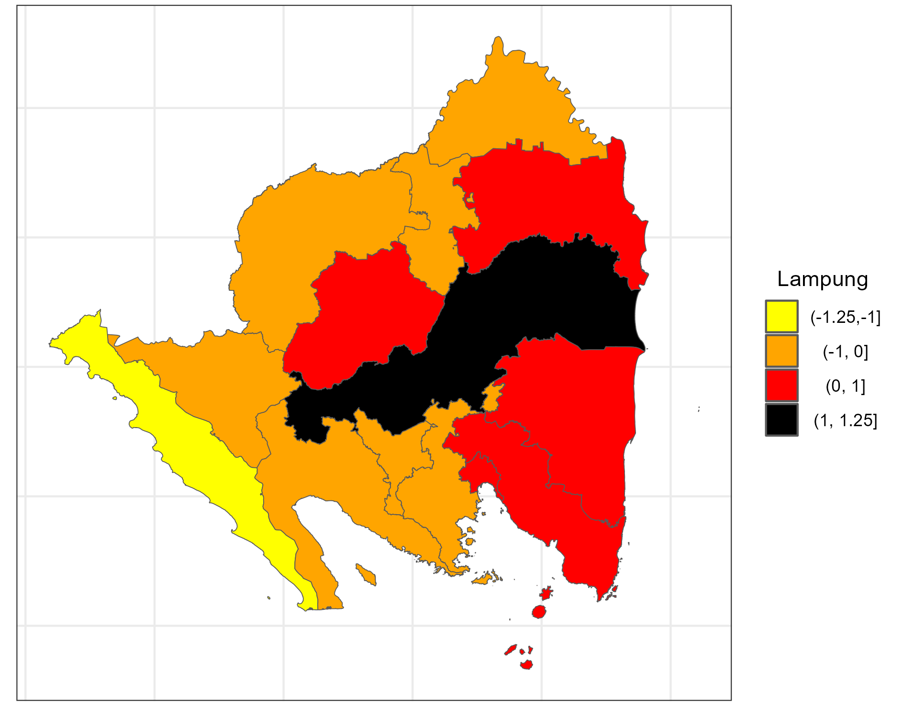 | 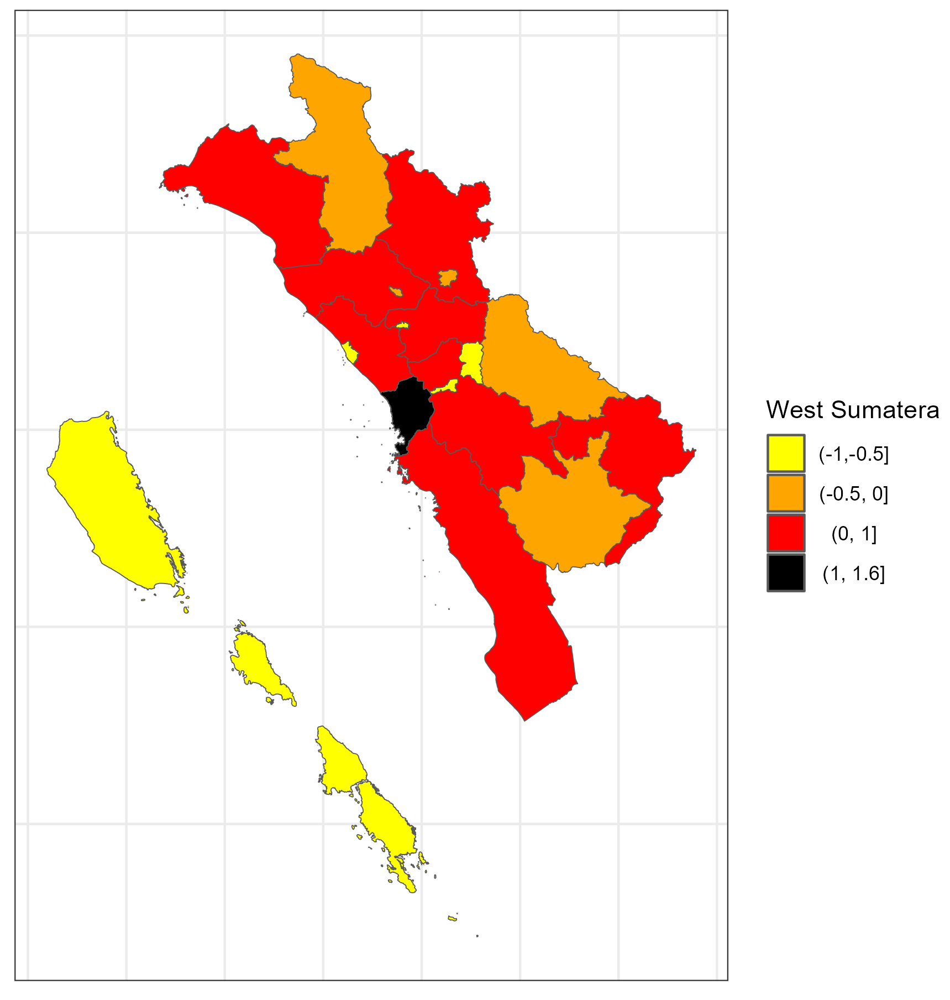 |

**West Sumatera**

Areas that have high spatial patterns for GRDP at current prices in West Sumatera Province are shown by the central part of the province. These regions include West Pasaman, Agam, Lima Puluh Kota, Padang Pariaman, Padang City, Tanah Datar, Solok, Pesisir Selatan, and Dharmasraya. These nine regions have spatial values above the provincial average, ranging from more than 0 to 1.6. The high spatial pattern in certain regions is certainly significantly influenced by several factors.

West Sumatera is famous for its various tourism objects, but the province still faces challenges in terms of economic growth where the problem is the main focus. The main problem is related to the percentage of poor people and the number of high school students under the Ministry of Education and Culture. The number of tourist destinations has resulted in an increase in the number of tourists visiting, which has affected economic growth. Therefore, the development of tourism, education, and social sectors can certainly boost economic growth in the province. Thus, areas with high spatial patterns that have good blue economic potential can increase economic growth in surrounding areas that have similar patterns.

**Riau**

Regions that have high spatial patterns for GRDP at current prices in Riau Province are shown by the western, upper central, and lower eastern regions of the province. These regions include Rokan Hilir, Bengkali, Kampar, Pekanbaru City, Siak, and Indragiri Hilir. These six regions have spatial values above the provincial average, ranging from more than 0 to 0.8. The high spatial pattern in certain regions is certainly significantly influenced by several factors.

Riau is a province rich in resources, but the potential of these resources has not fully impacted on community welfare. In fact, community welfare has a significant effect on economic growth. Two social aspects that have a significant effect on Riau's economic growth are the percentage of the population that has health insurance and the number of vocational school students under the auspices of the Ministry of Education and Culture. When these two factors are developed and have an impact on the economic growth of a region, the regions adjacent to each other will tend to provide the same economic growth pattern.

**Figure 6:** Spatial pattern of GRDP at current prices of Riau and Jambi Provinces.

| | |
|---|---|
| 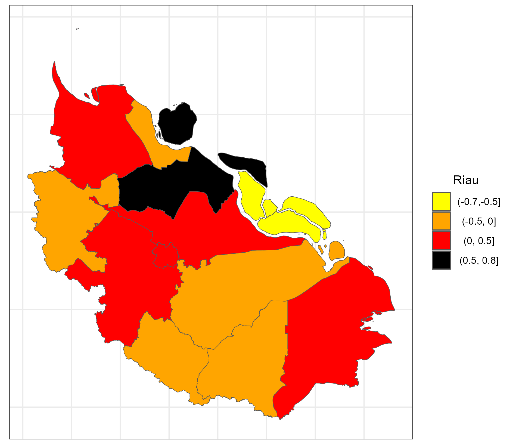 | 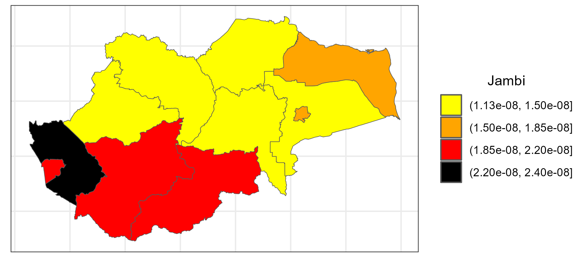 |

**Jambi**

Areas that have high spatial patterns for GRDP at current prices in Jambi Province are shown by the western part of the province. These areas include the cities of Sungai Penuh, Kerinci, Merangin, and Sarolangun. The four regions have spatial values above the provincial average of more than $1.85 \times 10^{-8}$ to $2.40 \times 10^{-8}$. High spatial patterns in certain regions are certainly significantly influenced by several factors.

Based on existing facts, Jambi's economic growth is strongly influenced by investment. Factors that influence investment in Jambi include the percentage of poor people, the percentage of people who have health insurance, access to decent drinking water sources, labor force participation rate, renewable energy infrastructure, fisheries activities, and waste management. A high percentage of poor people can reduce investment attractiveness because it indicates unstable economic conditions. Meanwhile, other factors, if managed well, can increase investment attractiveness. An increase in investment attractiveness in a region can affect investment attractiveness in neighboring regions that are close to each other so that economic growth in these regions tends to be similar.

**Bangka Belitung Island**

Areas that have high spatial patterns for GRDP at current prices in the Bangka Belitung Islands Province are indicated by the northern and southern parts of the province. These areas include Bangka, Pangkal Pinang City, and South Bangka. The three regions have spatial values above the provincial average of more than $1.275 \times 10^{-8}$ to $1.40 \times 10^{-8}$.

The fisheries sector is a mainstay in the economic growth of Bangka Belitung Islands, but social and environmental aspects are also important. The development of fisheries fishermen, unemployment control, and lighting distribution have an impact on economic growth in a region. Neighboring regions will also be affected by economic growth in the region.

**Riau Island**

Areas that have high spatial patterns for GRDP at current prices in Riau Islands Province are shown by the lower western part of the province. These regions include Karimun, Lingga, Batam City, Bintan, and Anambas Islands. The five regions have spatial values above the provincial average of more than $1.95 \times 10^{-8}$ to $2.3 \times 10^{-8}$.

Riau Islands has the highest number of tourists in Indonesia thanks to the existence of various attractive tourist destinations. The condition of the tourism sector affects the fisheries sector, household economy, and population health. These factors can increase the economic growth of the region and its surroundings with high spatial patterns.

**Figure 7:** Spatial pattern of GRDP at current prices of Bangka Belitung Island and Riau Island Provinces.

| | |
|---|---|
| 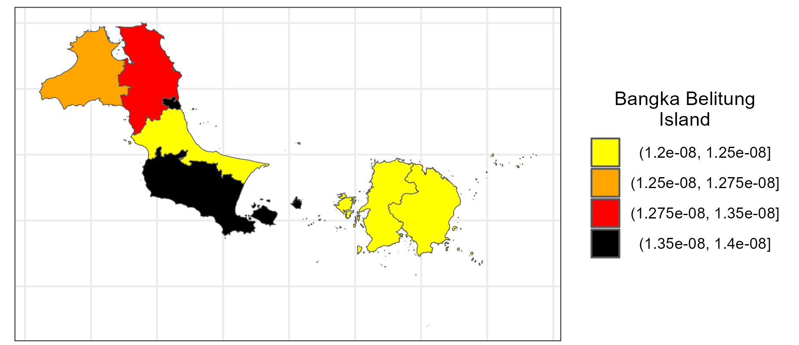 | 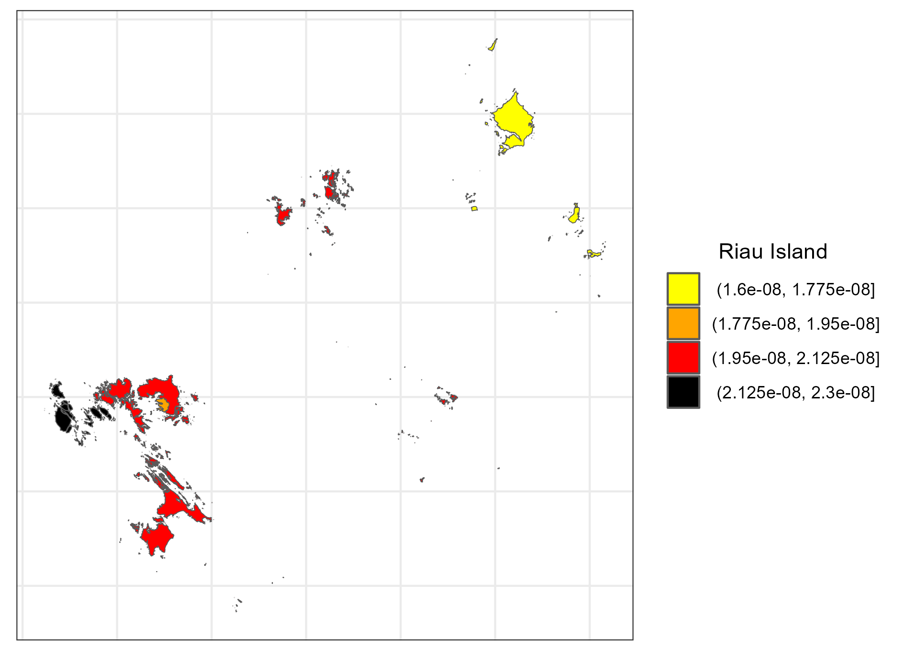 |

**Figure 8:** Spatial pattern of GRDP at current prices of North Sumatera and Aceh Provinces.

| | |
|---|---|
| 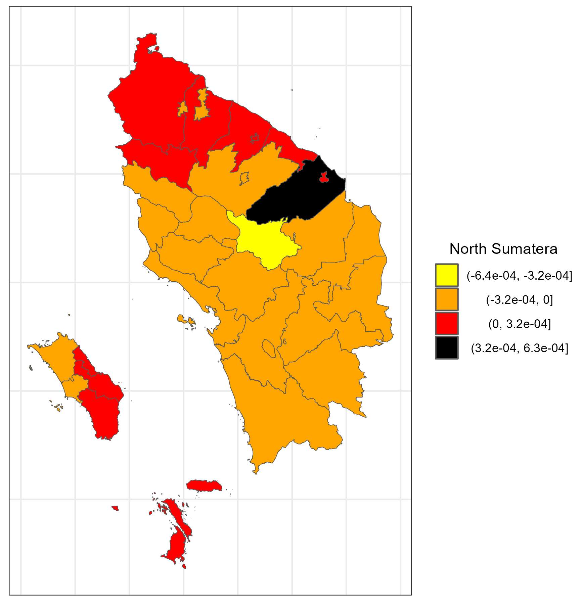 | 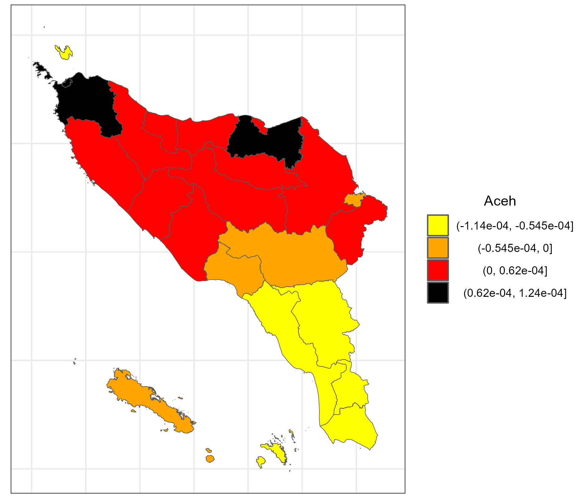 |

**North Sumatera**

Areas that have high spatial patterns for GRDP at current prices in North Sumatera Province are shown by the northern and southern parts of the province. These regions include Langkat, Karo, Deli Serdang, Serdang Bedagai, Tebing Tinggi City, Batubara, Asahan, Tanjung Balai City, Gunungsitoli City, Nias, and South Nias. The eleven regions have spatial values above the provincial average of more than 0 to $6.3 \times 10^{-4}$.

The COVID-19 pandemic affects inflation instability in North Sumatera, which also affects economic growth. Factors such as the percentage of poor people, renewable energy distribution, fisheries activities, and land management affect inflation stability. Focusing on these factors can promote economic growth through stable inflation.

**Aceh**

Areas with high spatial patterns for GRDP at current prices in Aceh Province are shown in the central and northern parts of the province. These regions include the cities of Banda Aceh, Aceh Besar, Aceh Jaya, Pidie, Pidie Jaya, West Aceh, Nagan Raya, Central Aceh, Bireuen, Bener Meriah, North Aceh, Lhokseumawe City, East Aceh, and Aceh Tamiang. Fourteen regions have spatial values above the provincial average of more than 0 to $1.24 \times 10^{-4}$.

Aceh, a province located at the tip of Sumatera Island, experienced an earthquake and tsunami in 2004 but managed to recover through infrastructure restoration. The infrastructure recovery helped Aceh to improve its economic growth after the tragic event. Infrastructure development is influenced by social, economic, and technological factors such as access to health, drinking water, electricity, labor, fishery activities, and cultivated land, which play an important role in supporting Aceh's economic growth.

**Figure 9:** Spatial pattern of GRDP at current prices of Bengkulu and South Sumatera Provinces.

| | |
|---|---|
| 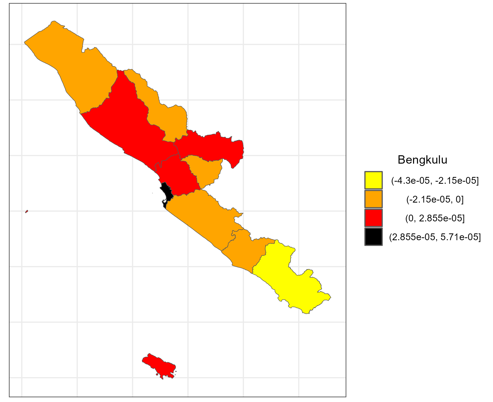 | 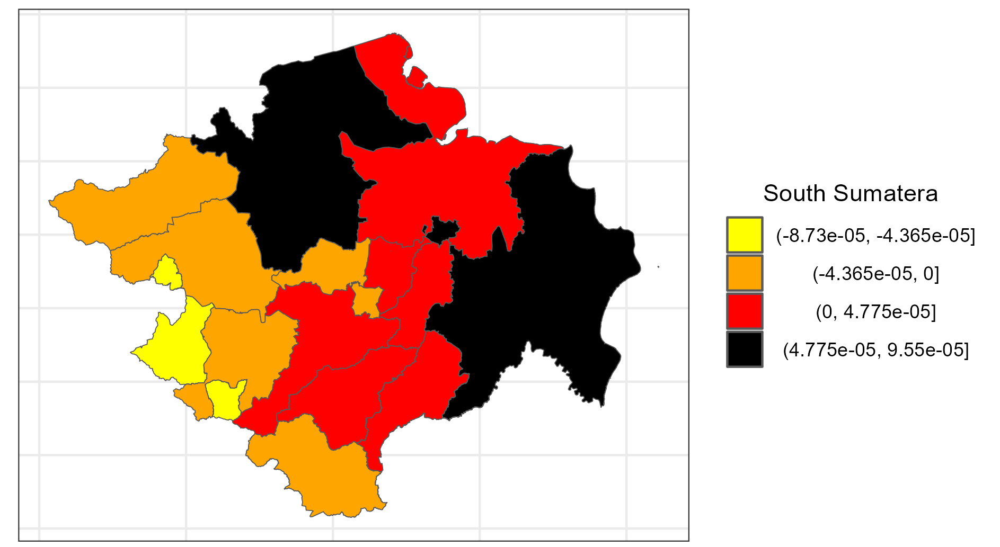 |

**Bengkulu**

Areas with high spatial patterns for GRDP at current prices in Bengkulu Province are indicated by the central and southern parts of the province. These include North Bengkulu, Central Bengkulu, Bengkulu City and Rejang Lebong. These four regions have spatial values above the provincial average of more than 0 to $5.71 \times 10^{-5}$.

Like Aceh, Bengkulu also relies on infrastructure development in the fisheries and aquaculture sectors for economic growth. The number of fishermen, vessels, aquaculture land area, and number of fishery households indicate the economic potential and infrastructure needs in the sector. These factors are interrelated and contribute to the development of infrastructure needed to increase productivity, efficiency, and ultimately drive economic growth.

**South Sumatera**

Areas that have high spatial patterns for GRDP at current prices in South Sumatera Province are shown by the central and eastern parts of the province. These regions include Musi Banyuasin, Banyuasin, Palembang City, Muaraenim, Ogan Komering Ulu, East Ogan Komering Ulu, Ogan Ilir, and Ogan Komering Ilir. These eight regions have spatial values above the provincial average of more than 0 to $9.55 \times 10^{-5}$.

Based on existing facts, South Sumatera experienced a phenomenon of decreasing poverty rates from 2019 to 2021, but the average poverty rate is still relatively high compared to other provinces on the Island of Sumatera. A high poverty rate hinders economic growth. Therefore, a focus on reducing the poverty rate is important to promote better economic growth. Reducing poverty requires a focus on several key factors. Access to health insurance, education, tourism, waste management, and clean water have a significant effect in improving people's welfare, labor productivity, and income, which in turn helps reduce poverty.

#### 4.3.5 Spatio-temporal interaction pattern of GRDP of all provinces in Sumatera Island

This study also explores the interaction between spatial patterns and temporal trends of GRDP at current prices in Sumatera Island. The parametric model analysis for Lampung and West Sumatera shows that the growth of GRDP at current prices in all regencies and cities in these two provinces is faster than the national average. In contrast, the nonparametric models for the other provinces show a more erratic pattern. The strong relationship between location and time for GRDP at current prices seen only in certain years suggests that this relationship is not consistent.

**Figure 10:** Spatial and temporal interaction patterns of each province in Sumatera Island for GRDP at current prices. *(multi-panel; panels span PDF pages 29–31)*

| | |
|---|---|
| 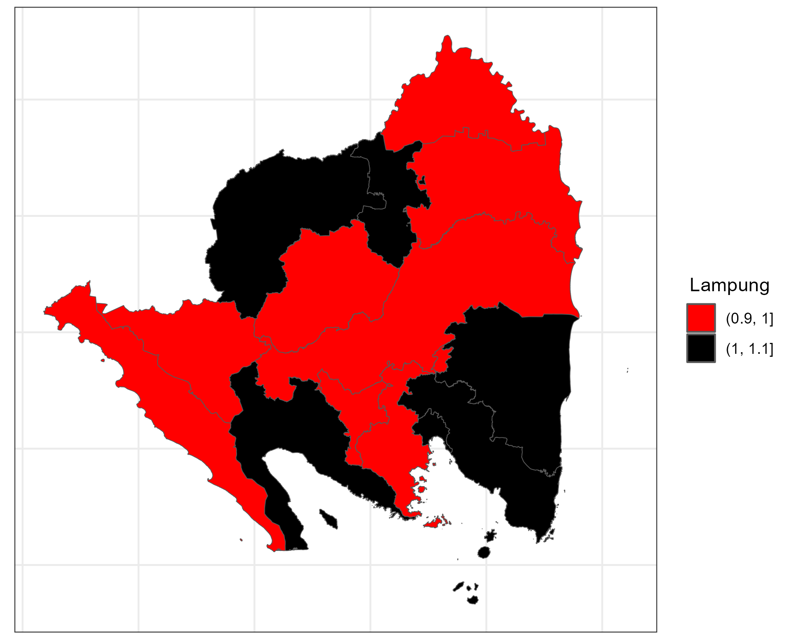 | 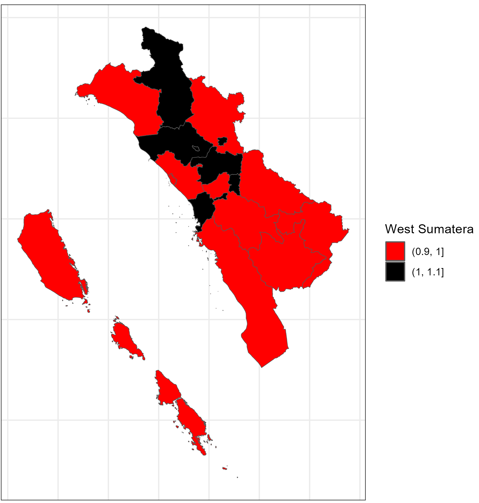 |
| 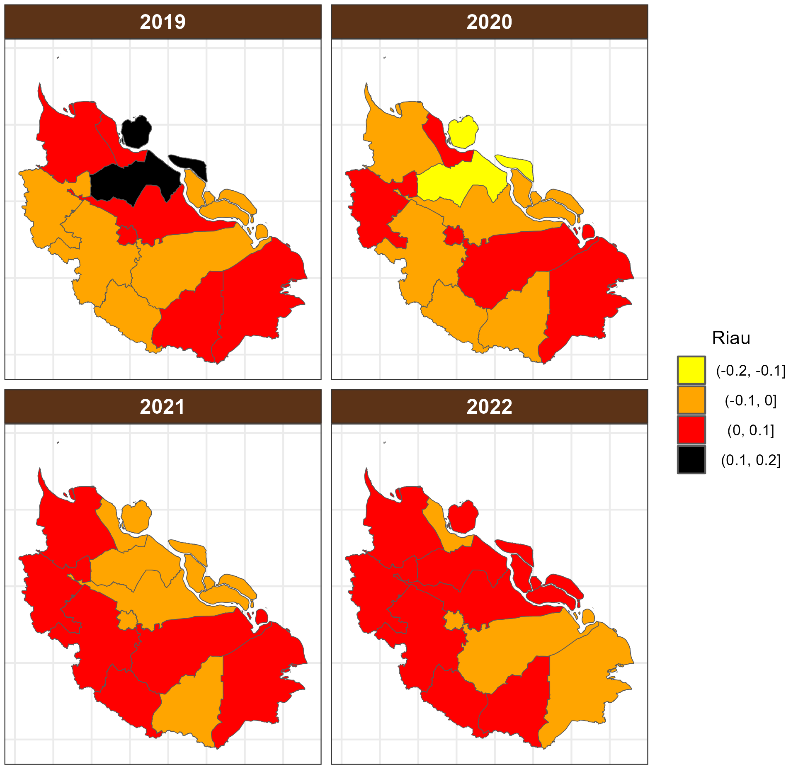 | 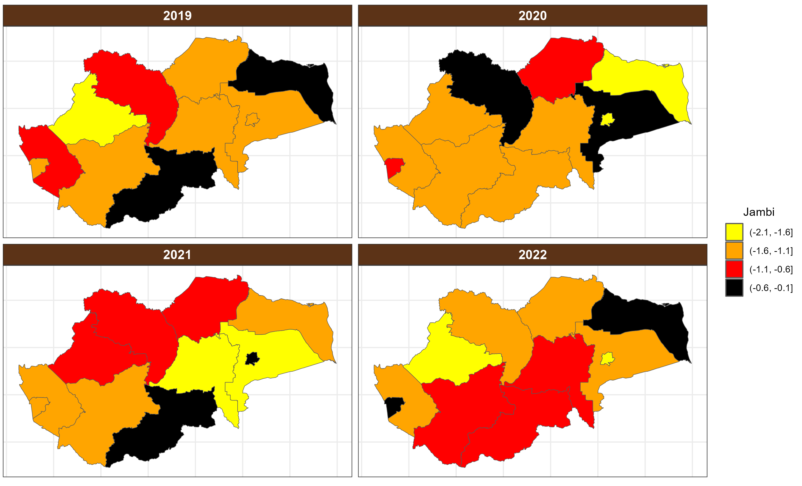 |
| 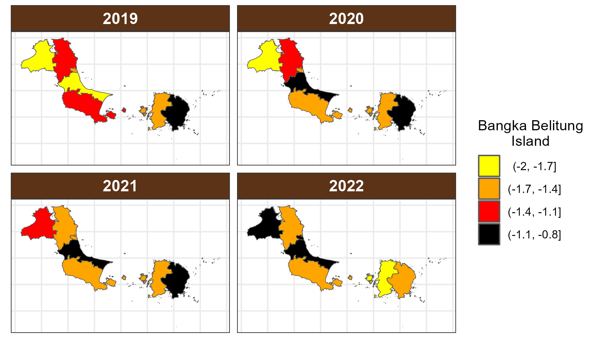 | 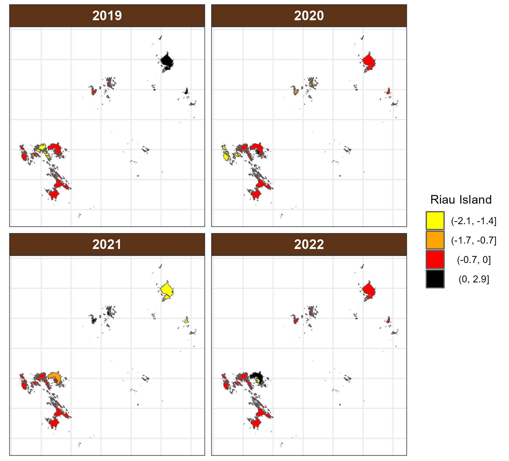 |
| 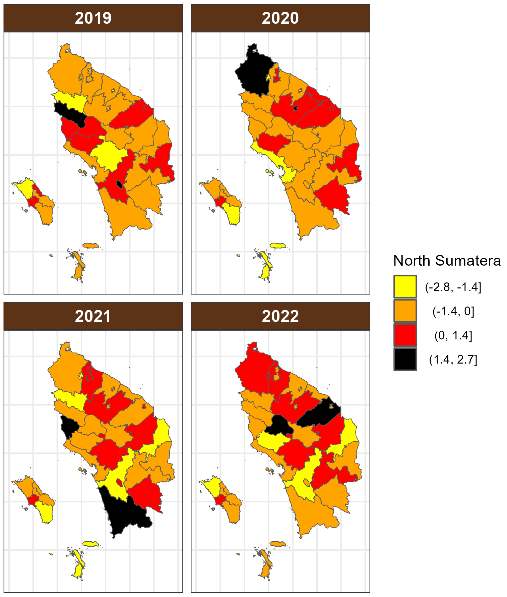 | 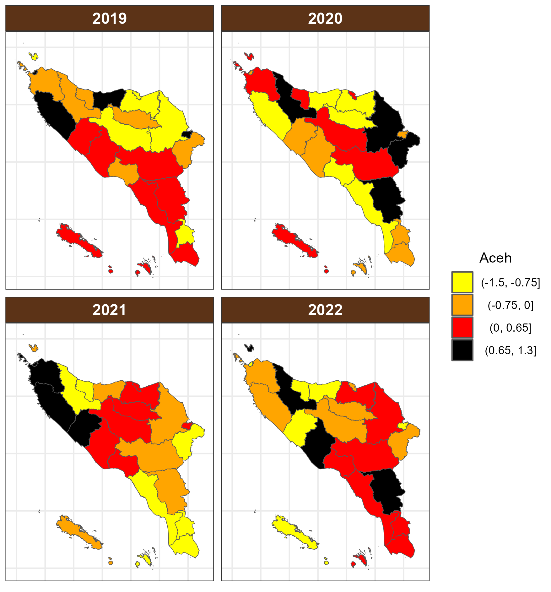 |
| 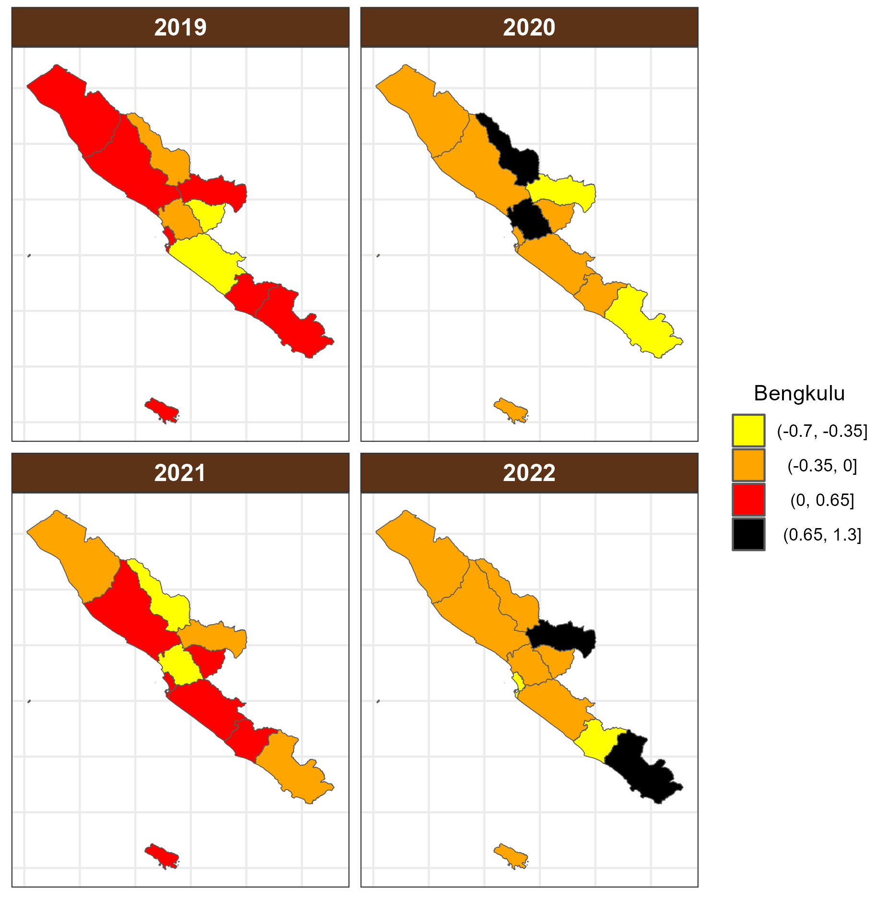 | 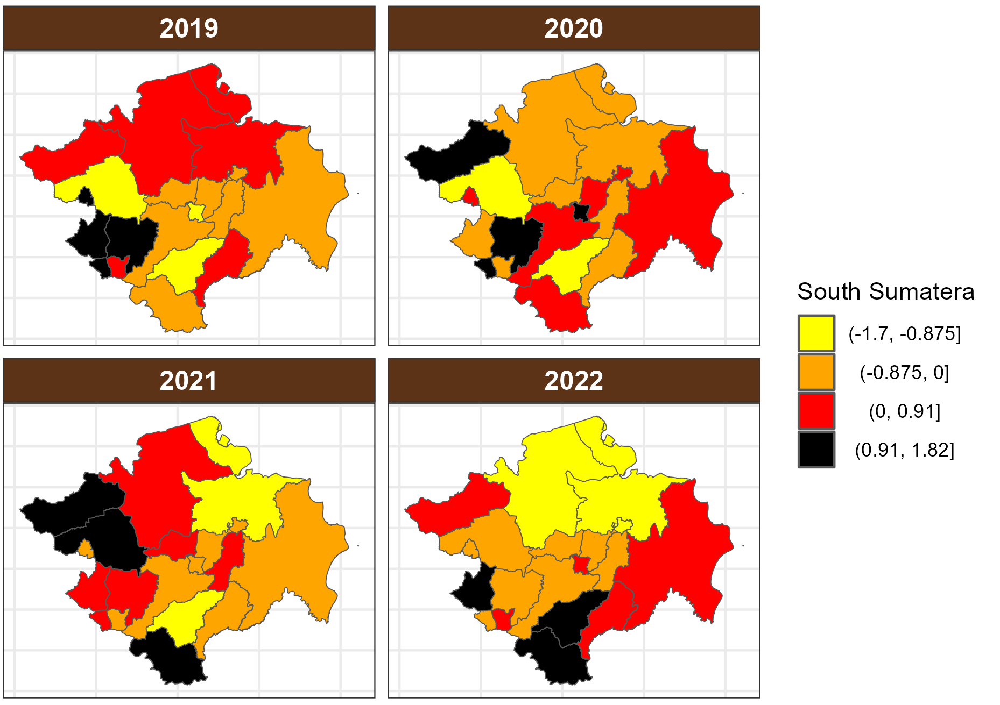 |

The visualization of the spatial-temporal interaction of GRDP at current prices in Sumatera Island as presented in Figure 10 shows that the parametric model tends to produce results that are more consistent and easier to interpret. Meanwhile, nonparametric models are able to capture the diversity and complexity of spatial and temporal relationships. This suggests that the simultaneous use of parametric and nonparametric models can provide a more comprehensive understanding of the dynamics of GRDP in Sumatera Island.

---

## 5 Conclusions

This research quantitatively explores the concept of blue economy by constructing a blue economy index (BEI) for each regency and city on the Island of Sumatera. Furthermore, this study integrates the indicators that make up the index into spatial-temporal modeling to analyze their influence on GRDP at current prices. Based on the BEI value that has been formed, the BEI value shown by all regencies and cities on the Island of Sumatera ranges between 3 and 40. The social dimension is the dimension that has the dominant contribution in the calculation of the index. Subsequently, model performance evaluation shows that four of six models tested can describe BEI characteristics in ten Sumateran provinces, namely parametric as well as nonparametric with interaction Types 1, 2, and 4. The results of spatio-temporal modeling show that several indicators from the BEI constituent dimensions have a significant effect on GRDP at current prices for most provinces on the Island of Sumatera.

Based on the spatial pattern, each province has different areas in terms of high spatial patterns. This means that adjacent regions tend to have similar GRDP characteristics. Meanwhile, in terms of global temporal trends, six of the ten provinces in Sumatera Island show an increasing trend in GRDP in the 2019-2022 period. This indicates that there is sustainable economic growth in these six provinces. Whereas, the other four provinces have fluctuating trends that indicate economic instability in the region. Then, in terms of spatial and temporal interactions, parametric models tend to provide results that are more consistent and easy to interpret, while nonparametric models are able to capture the diversity and complexity of spatial and temporal relationships. Overall, the GRDP at current prices prediction models for all provinces provide lower values than the actual values.

Blue economy development on the Island of Sumatera has great potential to increase GRDP at current prices and drive economic growth. Effective strategies include increased investment, appropriate blue economy sector management policies, human resource and infrastructure development, and inter-regional collaboration. Provinces with high BEI scores, such as West Sumatera, South Sumatera and North Sumatera, need to focus on key aspects such as waste management, tourism, education and aquaculture. Meanwhile, provinces with low BEI values, such as Aceh, Bengkulu, and Jambi, can capitalize on the potential of electricity, quiet water ponds cultivation, and marine businesses to increase GRDP at current prices. Collaboration between regions is essential to maximize the potential of the blue economy and encourage overall economic growth on the Island of Sumatera, so that the benefits can be felt by all levels of society and prosperity can be achieved.

This research opens up opportunities for more comprehensive follow-up studies:

1. The understanding of the blue economy can be expanded by including additional indicators such as the area of coral reefs, seagrasses, and mangroves, the number of marine tourism, and fish consumption per capita [39].
2. Spatial-temporal modeling can be done with other approaches, such as multiscale geographically temporally weighted regression (MGTWR) method with a nonbayesian approach using ordinary least squares (OLS), to get more comprehensive analysis results for modeling in local areas [46].
3. Studies for other regions using additional validation methods, such as Bayesian information criterion (BIC), can be conducted to obtain a more reliable model and provide a more informative picture of the relationship between the blue economy and GRDP. Thus, the sustainability of the potential of the blue economy to increase economic growth can be achieved and maintained.

**Acknowledgement** We would like to express our gratitude to everyone who contributed to the development of this manuscript. Their support, encouragement, and insightful feedback were greatly appreciated.

**Conflicts of Interest** The authors declare no conflict of interest.

---

## References

[1] M. Alharthi & I. Hanif (2020). Impact of blue economy factors on economic growth in the SAARC countries. *Maritime Business Review*, 5(3), 253–269. http://dx.doi.org/10.1108/MABR-01-2020-0006.

[2] M. E. A. Alqattan (2024). The Kuwaiti blue economy and its potential obstacles. *Heliyon*, 10(10), Article ID: e30975. https://doi.org/10.1016/j.heliyon.2024.e30975.

[3] A. Anastasya, S. Saridiva, D. Denysia, E. G. Palute, A. H. Iswar & R. Hidayat (2023). Pemodelan faktor-faktor yang mempengaruhi pertumbuhan PDRB di Kota Palopo. *Pedagogy: Jurnal Pendidikan Matematika*, 8(2), 55–63.

[4] K. Andayani & Miftahuddin (2018). Economic base determination and influence of several variables against contributions percentage of the GDRP in Aceh Besar district. In *IOP Conference Series: Materials Science and Engineering*, volume 352 pp. Article ID: 012053. http://dx.doi.org/10.1088/1757-899X/352/1/012053.

[5] Atmadi, N. R. Tarigan, I. P. A. B. P. C. Negara, N. Syalaisa & M. I. A. B. Ismail (2024). Linear mixed model approach: The effect of poor people & unemployment rate on various types of crime in 34 provinces in Indonesia. *International Journal of Applied Mathematics, Sciences, and Technology for National Defense*, 2(1), 37–48. https://doi.org/10.58524/app.sci.def.v2i1.350.

[6] K. Azzahra, R. N. Rachmawati & M. Syazali (2024). Modeling suspected Malaria cases in Papua province with second order Besag-York-Mollie 2 spatial regression. *International Journal of Applied Mathematics, Sciences, and Technology for National Defense*, 2(2), 73–82. http://dx.doi.org/10.58524/app.sci.def.v2i2.433.

[7] Badan Pusat Statistik (2024). *Produk Domestik Regional Bruto Provinsi-Provinsi di Indonesia Menurut Pengeluaran, 2020–2024*. Badan Pusat Statistik, Indonesia.

[8] J. R. Beattie & F. W. L. Esmonde White (2021). Exploration of principal component analysis: Deriving principal component analysis visually using spectra. *Applied Spectroscopy*, 75(4), 361–375. https://doi.org/10.1177/0003702820987847.

[9] R. S. Bivand, V. Gómez-Rubio & H. Rue (2014). Approximate Bayesian inference for spatial econometrics models. *Spatial Statistics*, 9, 146–165. https://doi.org/10.1016/j.spasta.2014.01.002.

[10] M. Blangiardo & M. Cameletti (2015). *Spatial and Spatio-Temporal Bayesian Models with R-INLA*. John Wiley & Sons, West Sussex, United Kingdom.

[11] G. Chhabra, V. Vashisht & J. Ranjan (2017). A comparison of multiple imputation methods for data with missing values. *Indian Journal of Science and Technology*, 10(19), 1–7. https://doi.org/10.17485/ijst/2017/v10i19/110646.

[12] A. Christina, R. N. Rachmawati & N. H. Pusponegoro (2025). Climate impact on blue economy index: Bayesian spatio-temporal regression with statistical downscaling in Sumatera. *Journal of Geospatial Science and Analytics*, 1(1), 13–34. https://doi.org/10.58524/jgsa.v1i1.9.

[13] M. Elsherif (2024). Nexus between blue economy, renewable energy and environmental sustainability in the MENA region: Evidence from panel threshold regression. *International Journal of Energy Economics and Policy*, 14(4), 169–185. https://doi.org/10.32479/ijeep.16125.

[14] M. E. Ervina & I. G. N. M. Jaya (2019). Analyzing factors affecting GRDP in Indonesia using spatial panel data model. *Modern Applied Science*, 13(1), 148–161. http://dx.doi.org/10.5539/mas.v13n1p148.

[15] H. R. Frost (2021). Eigenvectors from eigenvalues sparse principal component analysis (EESPCA). *Journal of Computational and Graphical Statistics*, 31(2), 486–501. https://doi.org/10.1080/10618600.2021.1987254.

[16] F. L. Gewers, G. R. Ferreira, H. F. D. Arruda, F. N. Silva, C. H. Comin, D. R. Amancio & L. D. F. Costa (2021). Principal component analysis: A natural approach to data exploration. *Association for Computing Machinery Computing Surveys*, 54(4), 1–34. https://doi.org/10.1145/3447755.

[17] G. I. Harya (2020). Penyusunan indeks pembangunan manusia kecamatan dan kabupaten Bojonegoro. *Jurnal Ilmiah Sosio Agribis*, 20(2), 48–66. https://doi.org/10.30742/jisa20220201223.

[18] B. M. S. Hasan & A. M. Abdulazeez (2021). A review of principal component analysis algorithm for dimensionality reduction. *Journal of Soft Computing and Data Mining*, 2(1), 20–30. https://doi.org/10.30880/jscdm.2021.02.01.003.

[19] D. Kaczan & A. R. D. Aquino. Empat strategi untuk ekonomi biru di indonesia: Refleksi dari laporan laut untuk kesejahteraan. World Bank Blogs 2021. https://blogs.worldbank.org/in/eastasiapacific/empat-strategi-untuk-ekonomi-biru-di-indonesia-refleksi-dari-laporan-laut-untuk.

[20] W. Kaczynski (2011). The future of blue economy: Lessons for European Union. *Foundations of Management*, 3(1), 21–32. http://dx.doi.org/10.2478/v10238-012-0033-8.

[21] M. Keliat, D. N. Sugianto, Yonvitner, R. Damanik, R. Noor, I. Lestari, F. R. Marzuki, R. D. Putra, D. Aryanti, E. P. Handayani, D. Lesdantina, L. Adrianto, U. Muawanah & F. Farizal (2022). *Prospek Ekonomi Biru bagi Pemulihan Ekonomi Indonesia*. Laboratorium Indonesia 2045 (LAB45), Jakarta, Indonesia.

[22] T. Khan & M. H. Emon (2024). Exploring the potential of the blue economy: A systematic review of strategies for enhancing international business in Bangladesh in the context of Indo-Pacific region. *Review of Business and Economics Studies*, 12(2), 55–73. http://dx.doi.org/10.26794/2308-944X-2024-12-2-55-73.

[23] J. Liang, Z. Yin, J. Yang, Y. Li, M. Xu, J. Li, M. Yang & L. Niu (2022). Bibliometrics and visualization analysis of research in the field of sustainable development of the blue economy (2006–2021). *Frontiers in Marine Science*, 9, Article ID: 936612. http://dx.doi.org/10.3389/fmars.2022.936612.

[24] R. M. Martínez-Vázquez, J. Milán-García & J. De Pablo Valenciano (2021). Challenges of the blue economy: Evidence and research trends. *Environmental Sciences Europe*, 33(1), Article ID: 61. https://doi.org/10.1186/s12302-021-00502-1.

[25] R. F. Maulina, A. Djuraidah & A. Kurnia (2019). Pemodelan kemiskinan di Jawa menggunakan Bayesian spasial probit pendekatan integrated nested laplace approximation (INLA). *Media Statistika*, 12(2), 140–151. https://doi.org/10.14710/medstat.12.2.140-151.

[26] A. Midlen (2024). Enacting the blue economy in the Western Indian Ocean: A 'collaborative blue economy governmentality'. *Environment and Planning E: Nature and Space*, 7(2), 627–653. https://doi.org/10.1177/25148486231198010.

[27] M. Nasution (2022). Potensi dan tantangan blue economy dalam mendukung pertumbuhan ekonomi di Indonesia: Kajian literatur. *Jurnal Budget: Isu Dan Masalah Keuangan Negara*, 7(2), 340–363. https://doi.org/10.22212/jbudget.v7i2.136.

[28] F. Ningsih (2017). *Pemodelan Faktor-Faktor Yang Mempengaruhi Produk Domestik Regional Bruto (PDRB) di Provinsi Riau Menggunakan Regresi Data Panel*. PhD thesis, Universitas Islam Negeri Sultan Syarif Kasim Riau, Riau, Indonesia.

[29] N. Nurmailis (2023). *Faktor-Faktor Yang Mempengaruhi Produk Domestik Regional Bruto (PDRB) di Provinsi Bengkulu Tahun 2018-2022 Menggunakan Analisis Regresi Data Panel*. PhD thesis, Universitas Negeri Padang, Padang.

[30] M. Nusrang, M. Fahmuddin & H. Hafid (2023). Penerapan metode structural equation modelling-partial least squares (SEM-PLS) dalam mengevaluasi faktor-faktor yang mempengaruhi PDRB di Indonesia. In *Seminar Nasional DIES Natalis Ke-62*, volume 1 pp. 543–548. Indonesia. https://doi.org/10.59562/semnasdies.v1i1.1088.

[31] L. A. Pace, O. Saritas & A. Deidun (2023). Exploring future research and innovation directions for a sustainable blue economy. *Marine Policy*, 148, Article ID: 105433. https://doi.org/10.1016/j.marpol.2022.105433.

[32] G. A. Pauli (2010). *The Blue Economy: 10 Years, 100 Innovations, 100 Million Jobs*. Paradigm Publications, New Mexico, USA.

[33] Pendi (2021). Analisis regresi dengan metode komponen utama dalam mengatasi masalah multikolinearitas. *Buletin Ilmiah Matematika, Statistika dan Terapannya (Bimaster)*, 10(1), 131–138.

[34] S. Phang, A. March, G. Touron-Gardic, K. Deane & P. Failler (2023). A review of the blue economy, potential, and opportunities in seven Caribbean nations pre-COVID-19. *ICES Journal of Marine Science*, 80(8), 2233–2243. http://dx.doi.org/10.1093/icesjms/fsac230.

[35] A. A. Pravitasari, M. I. D. Islamiyah, N. Iriawan, K. Fithriasari, S. W. Purnami & W. Ferriastuti (2020). Fernandez-steel skew normal mixture model using Bayesian approach for MRI-based brain tumor segmentation. *Malaysian Journal of Mathematical Sciences*, 14(2), 235–248.

[36] R. N. Rachmawati & N. H. Pusponegoro (2018). Spatio-temporal poverty analysis with INLA in hierarchical Bayes ecological regression. *Procedia Computer Science*, 135, 323–330. http://dx.doi.org/10.1016/j.procs.2018.08.180.

[37] S. B. A. Rasyid, E. P. Purnomo, L. Salsabila & A. T. Fathani (2022). Discourse analysis of online news on green economy and blue economy for sustainable development: The case in Indonesia. *Fronteira: Journal of Social, Technological and Environmental Science*, 11(1), 165–180. http://dx.doi.org/10.21664/2238-8869.2022v11i1.p165-180.

[38] A. Rianawati, N. K. Darmasetiawan, F. S. Hadi, J. Oktavianus & C. A. Utama (2024). Enhancement of Indonesia's blue economy sector through innovation and competitive advantage based on resource-based view theory. *Problems and Perspectives in Management*, 22(2), 165–181. http://dx.doi.org/10.21511/ppm.22(2).2024.14.

[39] L. A. A. T. Sambodo, D. D. P. Pane, L. H. Pertamawati, S. Maftukhah, I. T. Firdaus, T. Wikapuspita, S. K. Harianto, S. Collin, T. Muhammad, W. Mugijayani, C. Mangunsong, M. Suardhin, D. Narjoko, A. Fauzi, S. M. Nurrahmani, T. A. Nugrahaeni, M. T. Mukhairiq, M. A. R. Alfarisy, R. A. M. Manullang, R. Riyanto, K. Artika, F. Nurhaditia & R. Tamadhika (2023). *Indonesia Blue Economy Roadmap*. Ministry of National Development Planning/National Development Planning Agency (BAPPENAS), Jakarta, Indonesia.

[40] A. Sani, B. Abapihi, Mukhsar, R. Tosepu, I. Usman & G. A. Rahman (2023). Bayesian temporal, spatial and spatio-temporal models of dengue in a small area with INLA. *International Journal of Modelling and Simulation*, 43(6), 939–951. http://dx.doi.org/10.1080/02286203.2022.2139108.

[41] X. Wang, Y. R. Yue & J. J. Faraway (2018). *Bayesian regression modeling with INLA*. Chapman and Hall/CRC, Boca Raton, Florida.

[42] M. Wangge (2021). Penerapan metode principal component analysis (PCA) terhadap faktor-faktor yang mempengaruhi lamanya penyelesaian skripsi mahasiswa program studi pendidikan matematika FKIP UNDANA. *Jurnal Cendekia: Jurnal Pendidikan Matematika*, 5(2), 974–988. https://doi.org/10.31004/cendekia.v5i2.465.

[43] B. Wardhani, V. Dugis, Y. W. Santoso, A. S. Mubah, Y. W. Yu & A. Pratamasari (2023). The trap of the blue economy: Evidence from Lombok Island, Indonesia. *Journal of Marine and Island Cultures*, 12(3), 224–239. http://dx.doi.org/10.21463/jmic.2023.12.3.15.

[44] A. Wibowo, M. A. Suhufan & B. A (2018). *Rambu-Rambu Kebijakan Ekonomi Biru di Indonesia*. Transparency International Indonesia, Jakarta, Indonesia.

[45] D. Wijayanti & E. N. Laksono (2024). Analisis faktor-faktor yang mempengaruhi produk domestik regional bruto (PDRB) di Kabupaten Kota Provinsi Lampung tahun 2017–2021. *Jurnal Kebijakan Ekonomi Dan Keuangan*, 3(1), 10–15. https://doi.org/10.20885/JKEK.vol3.iss1.art2.

[46] C. Wu, F. Ren, W. Hu & Q. Du (2019). Multiscale geographically and temporally weighted regression: Exploring the spatiotemporal determinants of housing prices. *International Journal of Geographical Information Science*, 33(3), 489–511. https://doi.org/10.1080/13658816.2018.1545158.

[47] L. Yu, D. Duan, K. S. Min & T. Wang (2024). Advancing marine-bearing capacity and economic growth: A comprehensive analysis of blue economy resilience, network evolution, and technological influences in China's coastal areas. *Water*, 16(7), Article ID: 1019. https://doi.org/10.3390/w16071019.

[48] H. S. Zulkafli, G. Streftaris, G. J. Gibson & N. N. Zammitt (2016). Bayesian modelling of the consistency of symptoms reported during hypoglycaemia for individual patients. *Malaysian Journal of Mathematical Sciences*, 10(S), 27–39.
